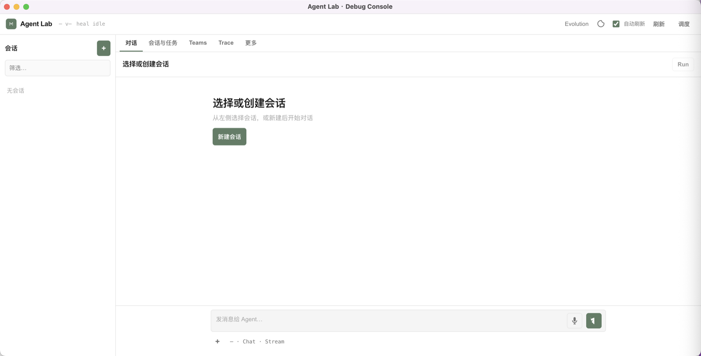

# Raw Agent Desktop

macOS desktop client for Raw Agent SDK.



## Features

- 🖥️ Native macOS application
- 🔧 Integrated daemon and web console
- 🎯 System tray integration
- 💾 Persistent state management
- ⚙️ Easy configuration via .env file

## Building

### Prerequisites

- Node.js >= 22
- macOS (for building macOS app)

### Build Steps

1. **Install dependencies:**
   ```bash
   npm install
   ```

2. **Build the entire monorepo:**
   ```bash
   # From the root directory
   npm run build
   ```

3. **Build web console in standalone mode:**
   ```bash
   cd apps/web-console
   npm run build
   cd ../..
   ```

4. **Build desktop app:**
   ```bash
   cd apps/desktop
   npm install
   npm run dist
   ```

   The built app will be in `apps/desktop/release/`.

### Quick Build Script

For convenience, you can use the build script:

```bash
# From root directory
npm run build:desktop
```

## Development

```bash
cd apps/desktop
npm run dev
```

## Configuration

The app stores configuration in:
- **State data:** `~/Library/Application Support/agent-desktop/state/`
- **User config:** `~/Library/Application Support/agent-desktop/.env`

On first run, you can configure your API keys and model settings via the tray menu → "Open Config (.env)".

## Distribution

The built `.dmg` file in `apps/desktop/release/` can be distributed to users.

Users can:
1. Mount the DMG
2. Drag "Raw Agent" to Applications
3. Launch and configure via tray menu

## Architecture

- **Main Process:** Electron main process manages:
  - Daemon (Node.js HTTP API server)
  - Web Console (Next.js standalone server)
  - Window and tray management
  
- **Renderer Process:** Loads the web console UI

- **State:** SQLite databases and logs are stored in the user data directory

## Troubleshooting

### Services won't start

Check logs in Console.app or run from terminal:
```bash
/Applications/Raw\ Agent.app/Contents/MacOS/Raw\ Agent
```

### Port conflicts

Edit config to change ports:
```bash
open ~/Library/Application\ Support/agent-desktop/.env
```

Add:
```
RAW_AGENT_DAEMON_PORT=7071
```

Then restart via tray menu → "Restart Services".
