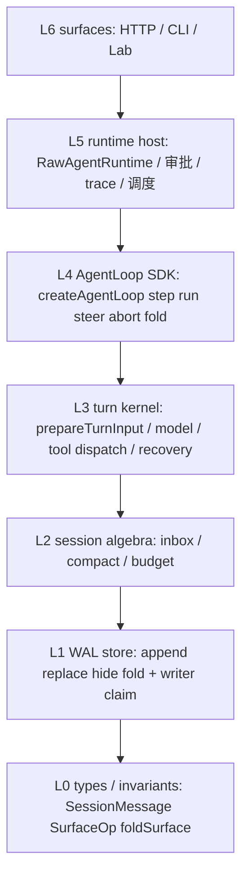

# Agent Loop 分层重构计划

> **状态**：Phase 1 已按此分层（`@ppeng/agent-core/{types,session,turn,loop}` 子路径；循环在 `turn/kernel.ts`；行为不变）。基线：`main` 已合入 WAL + fold + step inbox + turn-recovery（`0b79cb4` / PR #4）。  
> **约束**：保留 `createAgentLoop` / `step()` / async iterator / `steer()` / `fold()`；其他项目可从任意层接入；策略走 Lab 配置，不堆 `RAW_AGENT_*`。  
> **衔接**：[`CAPABILITY_ABSORPTION_PLAN.md`](CAPABILITY_ABSORPTION_PLAN.md) 轮次 1–5 已落地；本计划吸收其「仍可选」里真正挡住分层的两项（`RunOutcome`、steer 产品化），不重做 usage / watchdog / micro-compact。  
> **调研摘录**：施工时对照仓外 clone 符号名；源码证据见本页引用路径。外部仓库： [openai/codex](https://github.com/openai/codex)、[openai/openai-agents-js](https://github.com/openai/openai-agents-js)、[openclaw/openclaw](https://github.com/openclaw/openclaw)、[nousresearch/hermes-agent](https://github.com/nousresearch/hermes-agent)。

---

## 1. 结论先行

### 1.1 吸收（恰好 8 条主线）

只吸收**比当前 WAL+fold+inbox 更强**的能力。每条的「对方 / 我们缺 / 接到哪层 / 破坏面 / 为何不抄整包」见 §2。

| # | 硬能力 | 为什么比当前强 | 接到 |
|---|--------|----------------|------|
| A1 | **分层公开面**：`@ppeng/agent-core/{types,session,turn,loop}` 子路径；默认不拆新 npm 包 | 现在 `index.ts` `export *` + [`EMBEDDING_SDK.md`](EMBEDDING_SDK.md) 只承认 `RawAgentRuntime`，第三方无法只拿 fold / 只拿 step | L0–L4 出口；L5 仍是 daemon 宿主 |
| A2 | **Steer 受理回执**：`Started \| Steered \| NotSubmitted{reason}` | 现在 `enqueueSteer` 只 INSERT inbox，宿主不知道 compaction 轮拒收、无活跃 turn、或 schema 冲突 | L2 inbox + L4 `steer()` 返回值 |
| A3 | **工具发射边界 drain**（Lab 策略，默认关闭）：未启动的 sequential tool 合成配对 skip，再让 steer 进下一枪 | 现在 steer **只**影响下一枪、已排队的 tool_use 仍会全跑完——产品插话要等一整波工具 | L3 tool-loop 检查点；**不改正在飞的 model HTTP** |
| A4 | **WAL writer claim**：`activeWriterRunId` + append 带 `expectedWriterRunId` | 现在只有进程内 `runningSessions` Map；L1 被独立使用、或 run 被 supersede 时，过期 turn 仍能 `appendMessage` | L1 store |
| A5 | **`SessionSurfaceStore` 接口**：append/replace/hide/fold/claimInbox，SQLite 是一种实现 | 现在 fold 绑在 `SessionStore` + `SqliteStateStore`；「只用 L3、自备 store」做不到 | L1 契约 |
| A6 | **可序列化 interruption**：`waiting_approval` 带 `RunInterruptState`（open tool_call ids、step 游标），approve 后 `step()` 从 tools 阶段续，不必整段 `runSession` 重入猜状态 | 现在退出 dispatch + `status=waiting_approval`；恢复靠再调 `runSession`，step 游标不在契约里 | L4 事件 + L3 恢复 |
| A7 | **Abort/steer 必须闭合 tool wave**：合成 `tool_result`（或等价 hide+replace），fold 上 `unmatchedToolCallIds` 为空 | 现在 compact 有 `assertReplaceRangeClosed`；abort / 中途 steer **没有**强制闭合，严格供应商会把 `tool → user` 当成角色错乱 | L0 不变量 + L3 |
| A8 | **单一 `RunOutcome`**（含 `failureStage`） | [`CAPABILITY_ABSORPTION_PLAN.md`](CAPABILITY_ABSORPTION_PLAN.md) 已点名：终态散落 `updateSession(status)`，完成率虚高 | L4 终态；L5 只投影 |

### 1.2 明确不吸收

| 不吸收 | 原因 |
|--------|------|
| Cordis Fiber / 5ms 调度 / 每 token 一个节点 | 用户禁令；粒度错误，会打碎 prompt cache 与 fold 确定性 |
| 把 openai-agents-js 的 `run()` 当本仓样板 | 用户禁令；我们已有更强的 **step 级** API。只借其 **Session 接口 / interruption / RunResult**，不借「一次 run 到底」的产品形态 |
| 整包 `@openai/agents` harness、handoff 图、Realtime/SandboxAgent 产品 | 本仓自建 loop（见 [`harness/00-self-built-agent-loop.md`](harness/00-self-built-agent-loop.md)）；MCP/sandbox 我们已有自己的层 |
| Codex TS SDK 用 CLI 换 JSONL | 那是进程外包一层，不是可嵌入 kernel；我们要 **in-process** L4 |
| OpenClaw 的 IM 通道动物园、TUI 皮肤、48h 默认 timeout、Gateway 目录锁当唯一并发 | 产品壳，不是 loop 代数 |
| Hermes `conversation_loop.py`（约 8500 行上帝函数）、Honcho/pet UI、gpt-5.6 服务端 compaction 当默认 | 反模式 + 供应商锁定；本仓已有 `TurnRecoveryState` 与 fold 压缩 |
| 为分层新堆 `RAW_AGENT_*` | 违反 [`AGENTS.md`](../AGENTS.md)；A3 等策略进 Lab KV / `PATCH /api/.../settings` |

---

## 2. 对照表

四仓库均按 **2026-08-26** 浅克隆源码阅读（`/tmp/loop-research/`），不是 README 口号。

| 仓库 | 对方怎么做（证据） | 当前 ppeng | 差距（只记更强的） | 接到哪一层 |
|------|-------------------|------------|-------------------|------------|
| [openai/codex](https://github.com/openai/codex) | `codex-rs/protocol/src/turn_input.rs`：`start_or_steer_turn` → `TurnInputSubmission::{Started, Steered, NotSubmitted}`；`NotSubmittedReason`（NotIdle / 无活跃 turn / 本 turn 不可 steer / schema 不一致）。Compact 是独立 `SessionTask`（`codex-rs/core/src/tasks/compact.rs`），远程 v2 与本地摘要分轨。TS SDK（`sdk/typescript/src/thread.ts`）是 `thread.run()` / `runStreamed()` 事件流，**外包 CLI**。 | `enqueueSteer` 无回执；compact 已是 fold 上的 `appendReplacement`（强于「清历史重建」）。`AgentStepEvent` 已有 `turn_prepared` / `model_done` / `tools_done` / `compacted`。 | **Steer 回执 + 拒绝原因**。Turn 级事件命名可与 Codex `turn.started\|completed` 对齐别名，但不改现有 discriminant。不抄 CLI SDK、不抄远程 compaction 默认路径。 | A2 → L2/L4；事件别名 → L4 |
| [openai/openai-agents-js](https://github.com/openai/openai-agents-js) | `@openai/agents-core` 子路径 `./model` `./testing` `./sandbox`。`run.ts` `Runner` + `result.ts` `RunResult.interruptions` + 可序列化 `RunState`。`memory/session.ts`：`Session` 接口 `getItems/addItems/replaceHistoryWithCompaction`。`runner/steps.ts`：`NextStep` = handoff \| final_output \| run_again \| **interruption**。Pending input 在 filter 后才 admit（`pendingInput.ts`）。 | 已有 step 内核，比 `run()` 更适合嵌入。Session 是具体类。`waiting_approval` 不可作为 step 恢复点序列化。`index.ts` 一把梭导出。 | **Session 接口、interruption 作为 step、RunResult 单一终态、子路径导出**。不把 `run()` 变成唯一入口；不引入 handoff 编排替代 `spawn_subagent`。 | A1/A5/A6/A8 → L0–L4 |
| [openclaw/openclaw](https://github.com/openclaw/openclaw) | `packages/agent-core` 导出 `./agent-loop`。文档 `docs/concepts/queue-steering.md`：steer 在 **tool-launch** 检查；已跑的 tool 跑完；未启动 sequential 合成 skip result（`STEERING_TOOL_SKIP_MESSAGE`）；parallel 一批一个发射闸。Writer fence：`activeWriterRunId` / `expectedWriterRunId`（`src/config/sessions/transcript.ts`）。队列模式 steer/followup/collect/interrupt + cap/drop=summarize。 | Inbox 只在 `prepareTurnInput` 枪前 claim；tool 波次一旦 `model_done` 就会 `executeToolCalls` 全执行。WAL 无 writer claim。Lab 运行中发送已走 `/steer`（`usePlayChat.ts`）。 | **Writer claim**（必须）。**Tool-launch drain**（Lab 可选，默认关，保持「steer 不改 in-flight HTTP」）。drop=summarize 可作 inbox overflow 策略（Lab）。不抄通道/Gateway 锁。 | A3/A4 → L1/L3；overflow → L2 |
| [nousresearch/hermes-agent](https://github.com/nousresearch/hermes-agent) | `close_interrupted_tool_sequence`（`agent/message_sanitization.py`）在 `/stop` 后若尾为 tool 则补 assistant，避免 `tool → user` 角色错乱。`TurnRetryState` 把一次 API attempt 的 one-shot 恢复收成对象。`native_compaction.py` 仅 gpt-5.6 + api.openai.com。`conversation_loop.py` 本身是反面教材。 | `TurnRecoveryState` 已覆盖 truncated/empty/protocol；**abort 路径不闭合 open tool_call**。 | **闭合中断 tool wave**（必须，且用 WAL replace/hide，不要改历史行）。Retry 对象已有，只扩 A6 所需字段。不抄 8500 行 loop、不默认开服务端 compaction。 | A7 → L0/L3 |

当前已更强、**不必倒退**的：WAL 只追加 + `foldSurface`（对方多是 `getItems(limit)` 或清库重建）；`prepareTurnInput` 唯一组包缝；`step()` 可在 `model_done` 交还控制权；同 key steer 覆盖；compact 禁止切开 open tool wave。

---

## 3. 目标分层架构

依赖**只允许向下**。L5/L6 不得被 L1–L4 import。



| 层 | 职责 | 现有落点（拆之前） | 拆后目录（Phase 1） | 对外入口 |
|----|------|-------------------|---------------------|----------|
| **L0** | `SessionMessage`、`SurfaceOp`、`SurfaceNode`、`foldSurface`、tool-wave 不变量 | `types.ts` 片段 + `session/surface-invariants.ts` | `packages/core/src/session/surface-invariants.ts`（类型迁 `@ppeng/api-types` 或 `session/types.ts`） | `@ppeng/agent-core/types` |
| **L1** | 只追加 WAL；`append` / `replace` / `hide` / `fold`；writer claim；**无 loop** | `stores/session-store.ts` + migrations v12/v13 | `packages/core/src/session/wal-store.ts` | `@ppeng/agent-core/session` 的 `SessionSurfaceStore` |
| **L2** | inbox claim、auto-compact range replace、fold budget、micro-compact（仍只改视图） | `session/step-inbox.ts` `auto-compact.ts` `micro-compact.ts` `session-budget.ts` | 保持 `session/`，禁止 import `runtime.ts` | 同上包；`runAutoCompact` / `StepInboxStore` |
| **L3** | `prepareTurnInput` → `ModelAdapter.runTurn` → `decideTurnRecovery` → tool-loop；可选 tool-launch drain | `runtime/prepare-turn-input.ts` `turn-recovery.ts` `tool-loop.ts` + **`runtime.ts` 里 `_runSessionInner` 主体** | `packages/core/src/turn/`（新建）：`kernel.ts` `tool-dispatch.ts` | `@ppeng/agent-core/turn` |
| **L4** | `AgentLoopHandle`：`step` / `run` / async iterator / `steer` / `abort` / `fold`。**对外主入口（嵌入方）** | `runtime/agent-loop.ts` 仍薄；真正循环在 L5 | Handle 只依赖 `AgentLoopHost`（已有）；Host 的默认实现改调 L3 kernel 而非 2500 行 runtime | `@ppeng/agent-core/loop` |
| **L5** | daemon 才需要的编排：MCP 加载、mailbox、审批策略文件、trace/OTEL、scheduler、self-heal、swarm | `runtime.ts` 其余 + `SqliteStateStore` 聚合 | `packages/core/src/runtime.ts` 瘦身为 host façade | `@ppeng/agent-core`（默认导出，兼容旧嵌入） |
| **L6** | HTTP / CLI / web-console | `apps/daemon` `apps/cli` `apps/web-console` | 不进 core。现有 `channels/turn-kernel.ts` **改名为** `channels/channel-turn.ts`（它是 IM 适配，不是 L3） | 应用，不从 core 再导出 |

### 3.1 其他项目怎么接

```ts
// 只用 L1：自己写 loop，只要 fold
import { createMemorySurfaceStore, foldSurface } from '@ppeng/agent-core/session';
const store = createMemorySurfaceStore();
store.append(sessionId, 'user', [{ type: 'text', text: 'hi' }]);
const view = store.fold(sessionId);

// 只用 L3：自备 store，只要 turn kernel
import { runTurnKernel } from '@ppeng/agent-core/turn';
await runTurnKernel({ store: myStore, sessionId, model, tools, latch });

// 只用 L4：嵌入自己的产品，不起 daemon
import { createAgentLoop } from '@ppeng/agent-core/loop';
const loop = createAgentLoop(host, sessionId);
for await (const ev of loop) { /* turn_prepared | model_done | … */ }
await loop.steer('insert next shot');
await loop.fold();
```

`createAgentLoop` 继续吃 `AgentLoopHost`（已在 `runtime/agent-loop.ts`）。L5 `RawAgentRuntime.createAgentLoop` 只是 Host 的一种实现。

### 3.2 step 控制如何贯穿

不变式（Phase 0 冻结，后续破坏性重构不得改语义）：

1. **`step()`** 一次交出一个 `AgentStepEvent`；`mode==='step'` 时 `AgentLoopLatch.emit` 在非终态事件后暂停（现有实现）。
2. **正在飞的 `ModelAdapter.runTurn` HTTP 不因 steer 而改 body**。Steer 只进入 inbox；默认在下一枪 `prepareTurnInput` claim。
3. **A3 开启时**：检查点在 `model_done` **之后**、`executeToolCalls` **之前**（以及 sequential 每颗 tool 启动前）。这仍不是改 in-flight HTTP。
4. **`fold()`** 只读当前 surface，不 claim inbox。
5. **`waiting_approval` 与 `ended` 都是 latch 终态**；A6 之后 `waiting_approval` 可被下一个 `createAgentLoop(sessionId).step()` 从中断点续（同一 writer claim）。

### 3.3 包边界（关键决策）

**Phase 1–4 不拆 `@ppeng/session` / `@ppeng/agent-loop` npm 包。**

理由：[`MONOREPO_LAYERING.md`](MONOREPO_LAYERING.md) 已写「强耦合 runtime 不要无发布/CI 边界就拆包」。openai-agents-js 与 OpenClaw 的可嵌入性来自 **export subpath**（`@openai/agents-core/model`、`@openclaw/agent-core/agent-loop`），不是再开一个版本号。

做法：

- 保留单一 `@ppeng/agent-core`。
- `package.json` `exports` 增加 `./types` `./session` `./turn` `./loop`；主入口 `"."` 仍 re-export L5 + 上述子路径（兼容现有 `from '@ppeng/agent-core'`）。
- `src/index.ts` **停止** `export *` 内部 store / sandbox 实现（破坏性，见 §4）；内部改 `export` 白名单。
- 若未来出现「只要 WAL、不要 Node sqlite / sharp / pg」的独立发布需求，再把 L0–L2 升为 `@ppeng/session`——那是后续 CI 边界，不是本计划前置。

---

## 4. 破坏性重构清单

允许大刀阔斧；下列必须在 changelog / `EMBEDDING_SDK.md` 写迁移。

### 4.1 文件拆分（`runtime.ts` 2584 行是主目标）

| 现有 | 动作 |
|------|------|
| `packages/core/src/runtime.ts` `_runSessionInner` 循环体 | 迁 `turn/kernel.ts`（L3）。Host 只负责：构造 deps、MCP/mailbox、把 latch 传进去 |
| `runtime.ts` `applyOptionalFoldBudget` / `prepareMessagesForModel` / image contact sheet | 迁 L2/L3 `turn/prepare-view.ts`；**禁止**再从 `listMessages().slice` 当模型输入 |
| `runtime.ts` goal snapshot `listMessages(sid).slice(-8)`、`evolvingQueryText` | 改为 `foldMessages().slice`（审计可用 WAL；模型/判官必须 fold） |
| `runtime.ts` 工具审批 + `executeToolCalls` | 已部分在 `runtime/tool-loop.ts`；残余内联迁 `turn/tool-dispatch.ts` |
| `channels/turn-kernel.ts` | **改名** `channels/channel-turn.ts`，避免与 L3 撞名 |
| `src/index.ts` | 白名单导出；删除对 `stores/*` 实现类的 star export（[`EMBEDDING_SDK.md`](EMBEDDING_SDK.md) §5 已警告「不要依赖」，现兑现） |
| `doc/ARCHITECTURE.md` §5.1 / §5.3 | 仍写 `visibleMessages` 与「保留最近 24 条」——与 fold 真源矛盾，Phase 1 改文档 |

### 4.2 API 改名 / 删除的旧路径

| 旧 | 新 | 说明 |
|----|----|------|
| 模型路径任何 `listMessages().slice(-N)` | `foldMessages()` → 可选 budget | 审计/UI 仍可用 `listMessages`（WAL，含被阴影行的内容节点） |
| 内部变量名 `visibleMessages` | `packed.messages` / `foldView` | 已在 `prepareTurnInput` 部分完成；runtime 残留标识符删掉 |
| `getSessionMessages` 语义含糊 | 拆成 `getWalMessages`（UI）与 `foldMessages`（模型） | HTTP 列表默认 WAL，避免 Lab 看不到 replace 前原文；模型永不走这条 |
| `enqueueSteer(): InboxItem` | `steer(): SteerAck`（L4）；底层仍可返回 item | A2 |
| `runSession` 成功即 `status=completed` | `RunOutcome`：`completed \| idle \| waiting_approval \| failed` + `failureStage` | A8；HTTP 字段加 `outcome`，旧 `session.status` 继续映射一季度 |
| 隐式并发 run | L1 拒绝错误的 `expectedWriterRunId` | A4；现有 `runningSessions` 保留为 L5 快路径 |

### 4.3 包拆分

本阶段：**不新增 workspace 包**。只改 `@ppeng/agent-core` 的 `exports` 与目录。

### 4.4 数据 / 迁移

- 现有 v12 `session_messages.seq/surface_op`、v13 `session_inbox` **保留**。
- 新迁移（预估 v14）：`sessions.active_writer_run_id`（可空）；inbox 可选 `overflow_summary` 列（A3 的 drop=summarize，可延到 Phase 3）。
- 不改已有 seq 单调性；writer claim 失败 = 不写 WAL，不回滚历史。

---

## 5. 分阶段施工

Phase 0 必须先于一切。Phase 1 与文档同步可并行。Phase 2 / 3 在 Phase 1 目录稳定后并行（不同文件）。Phase 4 依赖 A1+A5。

### Phase 0 — 冻结 fold/step 为内核契约（测试锁）

**目标**：重构期间行为不变的「金丝雀」。不改产品语义。

- [ ] 把下列测试标为 **kernel lock**（CI job 名或 `node --test` 文件列表写进 `doc/TESTING.md`）：
  - `packages/core/test/session-surface.test.js`（fold 确定性、hide/replace、open wave 禁 compact）
  - `packages/core/test/prepare-turn-input.test.js`（枪前 claim、同 key 覆盖、**step 停在 model_done、steer 不进当枪**）
  - `packages/core/test/turn-recovery.test.js`
  - `packages/core/test/auto-compact-replace.test.js`
  - `packages/core/test/runtime.test.js` 中聊天主路径 + **`parallel tool calls execute in one assistant message`**
  - `packages/core/test/approval-policy.test.js` + example `06-approval.mjs`
- [ ] 加一条 **characterization**：`rg "listMessages\\(.*\\)\\.slice" packages/core/src/runtime.ts` 在模型路径上必须为 0（goal/evolving 改 fold 前先记 baseline，Phase 1 清零）。
- [ ] 契约注释锁定在 `runtime/agent-loop.ts` 文件头（已有）+ `harness/00-self-built-agent-loop.md`（已有）：禁止把 packing 塞回 adapter。

**并行**：无（锁测试是后续所有 PR 的前置）。

### Phase 1 — 包/目录分层（破坏性，行为不变）

**目标**：目录与 export 对齐 L0–L6；单测绿；嵌入方 import 路径可迁。

- [ ] 新建 `packages/core/src/turn/`，把 `_runSessionInner` 循环搬过去；`RawAgentRuntime.runSession` 变为 20 行委托。
- [ ] `SessionStore` 抽 `SessionSurfaceStore` 接口（方法：`getSession` `appendMessage` `appendReplacement` `hideByKey` `hideRange` `foldMessages` `listSurfaceNodes` `enqueueSteer` `claimInbox`）。SQLite 实现留在 `stores/session-store.ts`。
- [ ] `package.json` exports：`./types` `./session` `./turn` `./loop`。
- [ ] `index.ts` 白名单；内部实现改从子路径或 `src/` 深 import（daemon 用 workspace 深路径可暂时保留，Lab 禁止）。
- [ ] 重命名 `channels/turn-kernel.ts` → `channel-turn.ts`。
- [ ] 模型/判官路径清掉 `listMessages().slice`。
- [ ] 更新 [`EMBEDDING_SDK.md`](EMBEDDING_SDK.md)（补 `createAgentLoop`）、[`ARCHITECTURE.md`](ARCHITECTURE.md) §5.1/5.3、[`harness/00-self-built-agent-loop.md`](harness/00-self-built-agent-loop.md) 目录表。
- [ ] 更新 [`MONOREPO_LAYERING.md`](MONOREPO_LAYERING.md) backlog 第 4 条：由「暂不重构 runtime.ts」改为「按本计划拆，不拆 npm 包」。

**并行**：文档与代码拆分可两人；不可与 Phase 2 行为变更混在同一 PR。

**测试**：Phase 0 lock 全绿；`npm run test:examples`（现有 01–07 仍只调主入口）。

### Phase 2 — 吸收 OpenAI 侧更强点

对应 A1（收尾）、A2、A5、A6、A8。

- [ ] **A2** `SteerAck`：`steer()` / `POST /api/sessions/:id/steer` 返回 `{ status: 'queued'|'steered'|'rejected', reason?, item? }`。拒绝原因枚举对齐 Codex `NotSubmittedReason` 的子集：`no_session` / `compact_in_flight` / `non_steerable_turn`（预留）/ `empty`。默认仍是 queued→下一枪 claim（与现测「当枪看不到 steer」一致）。
- [ ] **A5** `createMemorySurfaceStore()`（测试/嵌入无 sqlite 也可；Node 22 嵌入仍可用 sqlite）。L3 kernel 只依赖接口。
- [ ] **A6** `AgentStepEvent` 的 `waiting_approval` 带 `interrupt: { toolCallIds, approvalIds, writerRunId }`。`createAgentLoop` 在 `status===waiting_approval` 时 `step()` 先 yield 该事件，approve 后再 `step()` 进入 `tools_done` 或下一枪，而不是 silently `runSession` 从头。序列化：JSON 进 `session.metadata.interrupt` 或独立表——优先 metadata 以免新表；若超过 4k 再迁表。
- [ ] **A8** `RunOutcome` 由 L4 `ended` 唯一写入；`failureStage`: `model` \| `tool` \| `approval` \| `recovery` \| `host`。Trace `turn_end` 带 outcome。这兑现吸收计划里的 RunOutcome，而不是再对照 ai-agent-node。
- [ ] 事件别名（非破坏）：文档标明 `model_done` ≈ Codex `turn` 内模型段；不改 wire 以免 Lab SSE 崩。

**不在本阶段**：把 `run()` 做成唯一 API；guardrail 框架整包；Session `getItems(limit)` 回退。

**并行**：A2 与 A8 可并行；A6 依赖 Phase 1 kernel 边界。

### Phase 3 — 吸收产品化 loop 点

对应 A3、A4、A7；OpenClaw/Hermes。

- [ ] **A4** writer claim：`runSession`/`createAgentLoop` 开始时分配 `writerRunId` 写入 session；L1 `append*` 校验。被 `abort` 或新 run supersede 后旧 claim 失效。Lab 无新 env。
- [ ] **A7** `abort()` 与 tool-launch skip：对 fold 上未匹配 `tool_call` 追加 `tool_result`（content 标明 `interrupted` / `skipped_due_to_steer`），或 hide 该 assistant 再 replace——**优先合成 result**，与 OpenClaw「transcript 保持配对」一致，也满足本仓 `unmatchedToolCallIds`。
- [ ] **A3** Lab「能力 / Agent Loop」设置项 `steerDrainPolicy`: `next_shot_only`（默认，锁测试保持）\| `tool_launch`。`tool_launch`：在 `checkToolApprovals` 之后、`executeToolCalls` 之前 claim `next-step`；若有 item，未启动 calls 写 skip result，**不**执行它们；steer 文本下一枪可见（仍不改 in-flight HTTP）。Parallel：整批一个闸（照抄 OpenClaw 语义，不抄代码）。
- [ ] Inbox overflow（可选同一 PR）：`drop=summarize` 当 unclaimed > cap（默认 20）时把最旧合成一条 system inbox——Lab 可配 cap；默认与现在「不丢」兼容（cap=∞ 直到显式打开）。

**并行**：A4 可先于 A3；A7 与 A3 共享合成 result 助手。

**不在本阶段**：多通道 debounce UX、TUI、`/queue interrupt` 品牌命令（abort 已有 `cancelSession`）。

### Phase 4 — 宿主可替换（无 daemon 的 SDK 集成）

- [x] example `packages/core/examples/08-agent-loop.mjs`：scripted adapter + `createAgentLoop` + `step()` / `for await` / mid-run `steer()` / `fold()`；**不** import daemon。
- [x] example `packages/core/examples/09-custom-wal-store.mjs`：L1 自 append + `foldMessages` / `foldSurface`（`createMemorySurfaceStore` from `@ppeng/agent-core/session`）。
- [x] `npm run test:examples` 纳入 08/09（`scripts/run-core-examples.mjs` 按编号扫描）。
- [x] 单测 `packages/core/test/embed-loop-no-daemon.test.js`：不 listen 端口、不读 `RAW_AGENT_AUTH_TOKEN`。
- [ ] [`EMBEDDING_SDK.md`](EMBEDDING_SDK.md) 改「唯一入口 RawAgentRuntime」为「嵌入主入口 L4；L5 是全家桶 host」（本 PR 仅在 examples 表补 08/09 路径）。

**并行**：examples 可与 Phase 3 文档同步；必须在 A5 接口落地后。

---

## 6. 验收标准 + 自检题

### 6.1 验收

| 项 | 通过条件 |
|----|----------|
| Kernel lock | Phase 0 列表在每次分层 PR 全绿 |
| 分层 import | 新 example 08/09 零 daemon；`@ppeng/agent-core/loop` 的 d.ts 不出现 `SqliteStateStore` |
| Steer 默认语义 | `prepare-turn-input.test.js`：当枪 `model_done` 文本不含 steer；下一枪 fold 含 steer |
| A3 默认关 | 未在 Lab 打开 `tool_launch` 时，tool 波次仍一次跑完（`runtime.test.js` parallel 用例） |
| Writer claim | 过期 run `appendMessage` 抛错或 no-op（选定一种，测试锁死）；新 run 可写 |
| 闭合 wave | abort 后 `unmatchedToolCallIds(fold(session))=[]` |
| 审批 | waiting_approval → approve → 续跑；tool_call 与 result 配对（现有审批测 + A6 新测） |
| 配置 | `rg "RAW_AGENT_STEER\\|RAW_AGENT_LAYER"` 为空；新策略在 discovery/settings 或 session metadata |

### 6.2 自检题（施工中每 PR 回答）

1. 能否**不起 daemon** 只用 L4？（Phase 4 example 08）
2. 能否自备 store 只用 L3？（example 09）
3. 能否只用 L1 fold、自己写 for-loop 调 model？（内存 store 单测）
4. `steer` 是否仍默认**只影响下一枪**、不改 in-flight HTTP？
5. `step()` 能否在 `model_done` 停下、不执行 tools？
6. `fold()` 是否只读、不 claim inbox？
7. compact / hide 是否仍不能切开 open tool wave？
8. Lab Play 运行中发送是否仍走 `/steer`，且打开 `tool_launch` 后才 skip 未启动 tools？
9. 是否新增了功能开关 env？若是 → 回退到 Lab KV。
10. `runtime.ts` 是否仍 >1500 行？Phase 1 结束应显著下降（目标 <800，循环不在此文件）。

---

## 7. 风险与回滚

| 风险 | 缓解 | 回滚 |
|------|------|------|
| 拆 `runtime.ts` 引入「两套循环」 | 唯一循环在 L3 kernel；L4 latch 与 L5 `runSession` 都调它（现有 `latch` 参数已是这条路） | 单 PR 可 revert；kernel lock 失败即停 |
| A3 破坏「steer 下一枪」测试 | 默认 `next_shot_only`；新测单独覆盖 `tool_launch` | 关 Lab 设置即旧行为 |
| Writer claim 误杀合法并发 | 同 session 本就禁止并发 `runSession`；claim 与 `runningSessions` 对齐 | 迁移 v14 列可空；空 claim = 旧行为 |
| 收紧 `index.ts` 打断深 import | 先 deprecate 一版：主入口保留 re-export 但 TS 标 `@deprecated`；daemon 改子路径 | 恢复 star export 仅作为紧急补丁 |
| A6 续跑重复执行 tools | interrupt 状态含已执行 `toolCallId` 集合；resume 只跑未完成 | 不做 A6 时仍走整段 `runSession`（今日行为） |
| 文档与代码双真源 | Phase 1 强制改 ARCHITECTURE 5.1；00-harness 已是 loop 真源 | — |
| 对照仓库代码污染 | 禁止把 `/tmp/loop-research` 或整文件粘进本仓；只借代数 | — |

**回滚策略**：每个 Phase 独立 merge。Phase 2+ 行为开关（Lab）可瞬间关。Phase 1 目录拆分若失败，用 git revert 该 merge，不在上面 hotfix 两套文件并存。

---

## 8. 与既有文档的关系

| 文档 | 本计划如何对待 |
|------|----------------|
| [`harness/00-self-built-agent-loop.md`](harness/00-self-built-agent-loop.md) | 循环真源；分层后改「关键代码入口」表，不改 WAL/fold 叙事 |
| [`CAPABILITY_ABSORPTION_PLAN.md`](CAPABILITY_ABSORPTION_PLAN.md) | 不重做轮次 1–5；承接 RunOutcome 与 steer 产品化 |
| [`EMBEDDING_SDK.md`](EMBEDDING_SDK.md) | Phase 1/4 重写稳定面：L4 为主入口 |
| [`MONOREPO_LAYERING.md`](MONOREPO_LAYERING.md) | 遵守「先目录、后拆包」；修正「暂不重构 runtime.ts」 |
| [`ARCHITECTURE.md`](ARCHITECTURE.md) | Phase 1 删除过期 visibleMessages / 24k 硬编码描述 |

---

## 9. 施工时禁止事项（再钉一次）

- 不要在 `cursor/agent-loop-surface-fold-f380` 上继续改（该能力已在 `main`）。
- 不要引入 Fiber、token 级图、或第三方 `run()` 替换 `createAgentLoop`。
- 不要为 A3/A4 加 `RAW_AGENT_STEER_DRAIN=1` 这类开关。
- 不要让 L3 依赖 `apps/daemon`。
- 不要把 compact 退回 `listMessages().slice(-N)`。
