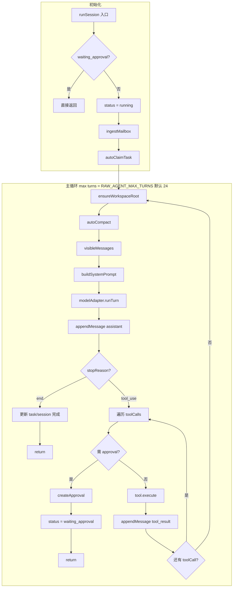
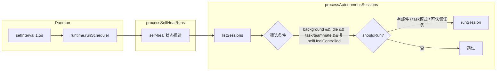
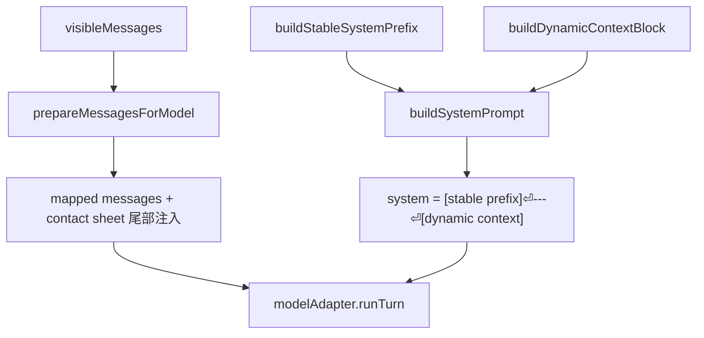
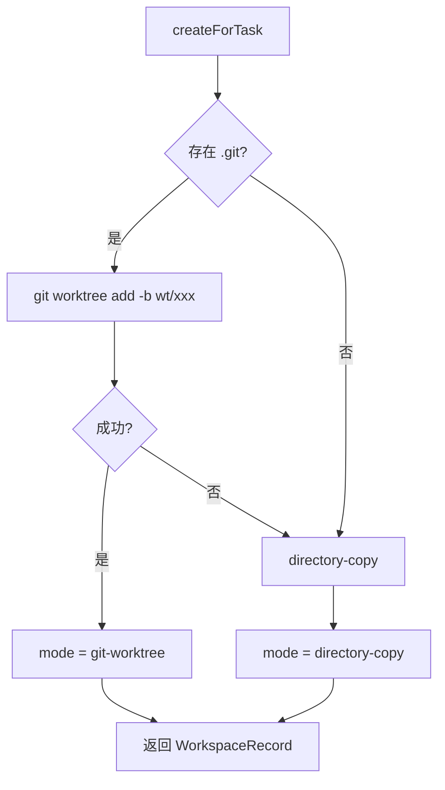
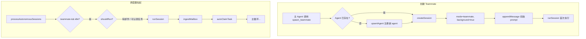
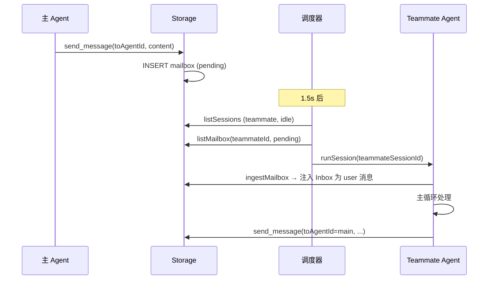
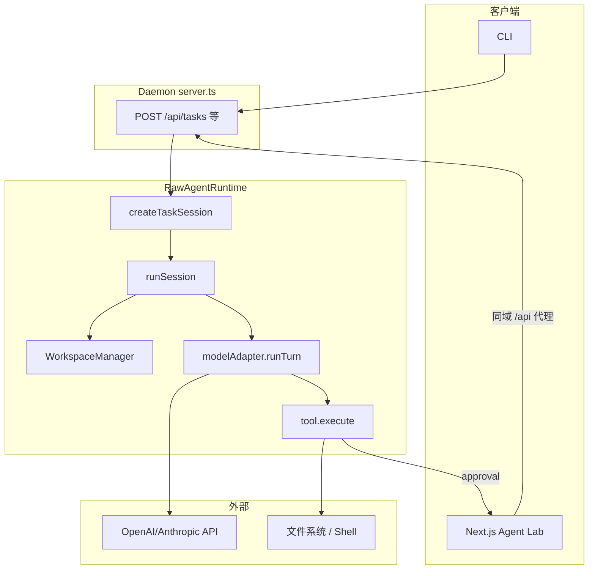
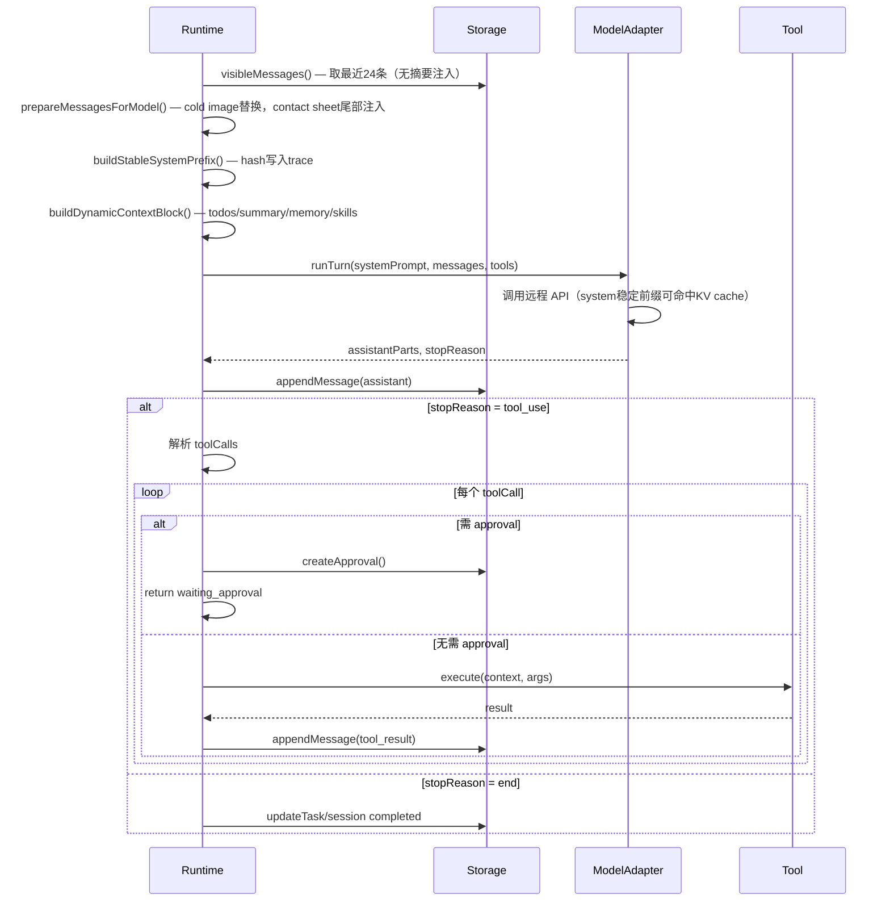

# Raw Agent SDK 项目架构

## 1. 概述

Raw Agent SDK 是一个类 Claude Code 风格的多智能体运行时，采用 Node.js 实现，包含本地 daemon、CLI、Web 控制台、SQLite 持久化、任务/工作区隔离、审批流程和团队编排能力。

## 2. 目录结构

```
ppeng-agent-core/
├── packages/
│   └── core/           # 核心运行时
│       ├── src/
│       │   ├── runtime.ts          # 主运行时（会话编排）
│       │   ├── storage.ts          # SQLite 持久化（Facade）
│       │   ├── stores/             # 领域存储 + 追踪
│       │   │   ├── session-store.ts
│       │   │   ├── image-asset-store.ts
│       │   │   ├── task-store.ts
│       │   │   ├── approval-store.ts
│       │   │   ├── mail-store.ts
│       │   │   ├── self-heal-store.ts
│       │   │   ├── background-job-store.ts
│       │   │   ├── misc-store.ts
│       │   │   ├── session-memory-store.ts
│       │   │   ├── storage-helpers.ts
│       │   │   ├── trace.ts           # 追踪事件写入
│       │   │   └── read-traces.ts     # 追踪事件读取
│       │   ├── model/              # 模型适配 + prompt 构建
│       │   │   ├── model-adapters.ts
│       │   │   ├── episodic-selection.ts
│       │   │   ├── cognitive-state.ts
│       │   │   ├── token-estimate.ts
│       │   │   └── prompt-builder.ts  # prompt 拼装
│       │   ├── tools/              # 内置工具（bash, read_file, grep …）
│       │   ├── skills/             # 技能注册 + 路由
│       │   ├── sandbox/            # OS 级沙箱 + 环境净化
│       │   │   ├── os-sandbox.ts      # macOS/Linux 沙箱提供者
│       │   │   └── env-sanitizer.ts   # Tier 0 环境变量净化
│       │   ├── self-heal/          # 自愈调度 + 执行器
│       │   ├── approval/           # 审批策略
│       │   ├── mcp/                # MCP JSON-RPC + stdio
│       │   ├── types.ts, errors.ts, env.ts, id.ts, logger.ts
│       │   └── index.ts
│       └── test/
├── apps/
│   ├── daemon/         # HTTP API 服务
│   ├── cli/            # 终端客户端
│   └── web-console/    # Next.js Agent Lab 控制台
├── doc/                # 统一文档目录
├── package.json
└── .env.example
```

## 3. 模块架构

### 3.1 核心包 (packages/core)

| 模块 | 职责 |
|------|------|
| `runtime.ts` | 会话编排、任务执行、工具调用、调度循环 |
| `storage.ts` | SQLite 持久化，管理 agents/sessions/tasks/approvals/workspaces/mailbox |
| `model-adapters.ts` | 模型抽象：Heuristic / OpenAI 兼容 / Anthropic 兼容 |
| `tools.ts` | 内置工具（read_file, write_file, bash, TodoWrite, harness_write_spec 等） |
| `workspaces.ts` | 工作区创建：git-worktree 或 directory-copy |
| `builtin-agents.ts` | main / planner / generator / evaluator / researcher / implementer / reviewer / **self-healer** |
| `self-heal-policy.ts` / `self-heal-executors.ts` | 自愈策略（白名单 `npm run`、合并/重启辅助） |
| `builtin-skills.ts` | 内置 skill 片段与 `matchSkills`（如 Planning, Subagents, Guided learning）；磁盘 skills 见 `skill-registry.ts` |
| `skill-registry.ts` | 扫描 `skills/` 与 `~/.agents/**/SKILL.md`，解析 frontmatter，合并覆盖 |
| `skill-router.ts` | 词法 shortlist + `legacy` / `hybrid` 路由模式（环境变量可切）；基线说明见 `doc/skill-router-baseline.md` |

### 3.2 应用层

| 应用 | 职责 |
|------|------|
| `apps/daemon` | HTTP API、`/` 最小 stub 页、后台调度（每 1.5s 调用 runScheduler）；**不**再托管旧版控制台源码 |
| `apps/cli` | 通过 HTTP 调用 daemon，执行 chat/send/task/approve/**self-heal**/daemon-restart 等命令 |
| `apps/web-console` | **Next.js 15（App Router）**：浏览器访问 Next，REST/SSE 经同源 `/api/*` 由 `middleware.ts` 在**运行时**按 `DAEMON_PROXY_TARGET` 转发到 daemon；实现 Playground（流式、thinking、工具折叠、Markdown）、Ops/Teams/Trace/More 等；开发 `npm run dev:web-console`，生产 `npm run build:web-console` + `npm run start:web-console` |

## 4. 数据模型

### 4.1 核心实体

```
Session (会话)
├── mode: chat | task | subagent | teammate
├── status: idle | running | waiting_approval | completed | failed
├── agentId, taskId?, workspaceId?, parentSessionId?
├── background: boolean
└── todo[], summary[]

SessionMessage / MessagePart
├── role: system | user | assistant | tool
├── parts: TextPart | ToolCallPart | ToolResultPart
└── createdAt

Task (任务)
├── status: pending | in_progress | completed | failed | cancelled
├── ownerAgentId?, blockedBy[]
├── workspaceId?
└── artifacts[]

Workspace (工作区)
├── mode: git-worktree | directory-copy
├── sourcePath, rootPath
└── taskId

Approval (审批)
├── toolName, args
├── status: pending | approved | rejected
└── sessionId

TaskEvent (任务事件)
├── taskId, kind, actor
├── payload: Record
└── createdAt

BackgroundJobRecord (后台任务)
├── sessionId, command
├── status: running | completed | error
└── result?
```

### 4.2 任务依赖 (blockedBy)

Task 支持 `blockedBy: string[]` 指定依赖的其他 task。当被依赖的 task 完成时，`unblockDependentTasks` 会移除其 id 并可能将依赖方状态置为 `pending`。

### 4.3 存储表 (SQLite)

- `agents` / `sessions` / `session_messages` / `tasks` / `task_events`
- `approvals` / `workspaces` / `mailbox` / `background_jobs`
- `self_heal_runs` / `self_heal_events` / `daemon_control`（自愈与重启握手）

### 4.4 TaskEvent 类型

| kind | 触发时机 |
|------|----------|
| `task.created` | createTask 时 |
| `workspace.bound` | ensureWorkspaceRoot 绑定工作区时 |
| `task.completed` | session 完成且 mode=task 时 |

## 5. 执行流程

### 5.1 会话执行 (runSession) — Agent 主循环



### 5.2 调度器 (runScheduler)

每 1.5 秒由 daemon 调用：**先** `processSelfHealRuns`（自愈状态机），**再** `processAutonomousSessions`。带 `metadata.selfHealControlled` 的 task 会话仅由自愈机驱动，避免与普通 task 自动轮询重复进入 `runSession`。



### 5.2.1 自愈（Self-heal）

- **HTTP**：`POST /api/self-heal/start`（body 可为 `{ "policy": { ... } }` 或与 policy 平铺的字段）、`GET /api/self-heal/status`、`GET /api/self-heal/runs`、`GET /api/self-heal/runs/:id`、`GET .../events`、`POST .../stop|resume`。
- **CLI**：`self-heal start|status|runs|show|logs|stop|resume`；合并并需换进程时 **`GET /api/daemon/restart-request`** + 人工重启 daemon 后 **`POST /api/daemon/restart-request/ack`**（`daemon restart-status` / `restart-ack`）。
- **流程**：`pending` → 创建带 `self-healer` 的 task + worktree → `running_tests`（仅白名单 `npm run`，由 `self-heal-executors` 执行）→ 失败则 `fixing`（单次 `runSession` 修复波）→ 再测；通过且 `autoMerge` 则主仓 `git merge` worktree 分支（directory-copy 工作区不支持自动合并）；`autoRestartDaemon` 时在 `daemon_control` 写入 `restart_request` 供外部 supervisor 处理。
- **并发**：同时仅允许一条进行中的自愈 run（第二条 `start` 返回 409）。

### 5.3 上下文压缩 (autoCompact)

当 `estimateSize(messages) >= RAW_AGENT_COMPACT_TOKEN_THRESHOLD`（默认 24,000）时：
1. 保留最近 `MAX_VISIBLE_MESSAGES`(24) 条
2. 调用 `modelAdapter.summarizeMessages` 压缩更早的消息
3. 将旧消息归档到 `stateDir/transcripts/{sessionId}/*.jsonl`
4. 更新 `session.summary`；下次请求时摘要出现在 **system prompt 动态上下文块**（见 §12）

### 5.4 Prompt 组装链路



**稳定前缀**（跨轮不变）：agent 身份、固定规则、repo/workspace 路径、harness 角色文字。

**动态上下文**（每轮更新）：task 状态、todos、rolling summary、session_memory（上限 20 条/scope）、skill routing shortlist。

两者以 `\n\n---\n\n` 分隔，动态块在后，保证 provider 的 KV cache 前缀在同一会话内尽量复用。
每轮 `turn_start` trace 事件中写入 `stablePrefixHash`（16 位 hex），便于观测缓存命中情况。

### 5.4 后台任务 (bg_run)

`bg_run` 工具在 session 的 workspace（或 repoRoot）中 spawn 子进程执行命令。完成后：
- 更新 `background_jobs` 表 status、result
- 将输出作为 user 消息 append 到 session，触发下一轮 runSession

### 5.5 工作区创建



## 6. 模型适配器

| 适配器 | 用途 | 配置 |
|--------|------|------|
| `heuristic` | 本地无密钥模式，简单规则回复 | 默认 |
| `openai-compatible` | OpenAI 兼容 chat completions | RAW_AGENT_BASE_URL, API_KEY, MODEL_NAME |
| `anthropic-compatible` | Anthropic API；自动在 system 添加 `cache_control: ephemeral` 以启用 prompt cache | RAW_AGENT_ANTHROPIC_URL, API_KEY, MODEL_NAME |
| `hybrid-router`（组合） | 消息中含 `image` part 时走 VL，否则走文本模型 | 配置 `RAW_AGENT_VL_*` 后由 `createModelAdapterFromEnv` 自动包装 |

工具定义按名称字母序排列，工具调用参数使用 canonical JSON（键字典序），保证 tool payload 在同一工具集下跨轮字节稳定。参见 `doc/PROMPT_CACHE.md` 了解完整缓存策略。

**视觉与图片**：会话消息支持 `ImagePart`（引用 `image_assets` 表，文件落在 `stateDir/images/<session>/`）。Daemon 提供 `POST /api/sessions/:id/images/ingest-base64` 与 `.../fetch-url`。含图用户轮默认经 router 调用 VL。内置工具 `vision_analyze` 在有 `RAW_AGENT_VL_MODEL_NAME` 时对指定 `asset_ids` 做额外 VL 调用。热图数量超限时，`maintainImageRetention` 可将旧图压为 contact sheet（`sharp`），更新 `session.metadata.imageWarmContactAssetId`，并把过期的原图标记为 `cold`。

**Subagent 角色映射**：`spawn_subagent(prompt, role)` 中 `research`→researcher、`implement`→implementer、`review`→reviewer、`planner`→planner、`generator`→generator、`evaluator`→evaluator，否则用父 agent。

### 6.1 长运行 Harness（对齐 Anthropic planner / generator / evaluator）

- **Planner**：短提示扩展为高层产品说明与功能边界；用 `harness_write_spec(kind=product_spec)` 写入 `.raw-agent-harness/product_spec.md`；可用 `task_create` + `blockedBy` 排期。
- **Generator**：一次一个 sprint/功能；实现前用 `harness_write_spec(kind=sprint_contract)` 写可验收的 sprint 合约；实现后优先 `spawn_subagent(role=evaluator)` 做外部质检。
- **Evaluator**：独立、偏怀疑的 QA；`harness_write_spec(kind=evaluator_feedback)` 记录结论。
- **上下文**：仍依赖现有 `autoCompact` + `session.summary`；结构化 Markdown 作为跨压缩/子会话 handoff 的补充。
- **环境**：`RAW_AGENT_MAX_TURNS` 可提高单轮 `runSession` 的 turn 上限（长 sprint）。

## 7. 内置工具 (22 个)

| 工具 | 说明 | approvalMode |
|------|------|--------------|
| `read_file` | 读文件/列目录 | never |
| `vision_analyze` | 对会话内图片资产调用 VL（OCR / 描述） | never |
| `write_file` | 写文件 | auto |
| `edit_file` | 替换文本 | auto |
| `bash` | 执行 shell | auto（含 rm/git reset 等需审批） |
| `TodoWrite` | 更新 todo 列表 | never |
| `load_skill` | 加载 workspace skill | never |
| `task_create` / `task_get` / `task_update` / `task_list` | 任务 CRUD；`task_update` 支持 metadata 浅合并 | never |
| `harness_write_spec` | 写入 `.raw-agent-harness/` 下 product_spec / sprint_contract / evaluator_feedback | never |
| `spawn_subagent` | 同步子 agent | never |
| `spawn_teammate` | 异步 teammate | never |
| `list_team` | 列出 agent | never |
| `send_message` | 发 mailbox 消息 | never |
| `read_inbox` | 读收件箱 | never |
| `bg_run` / `bg_check` | 后台任务 | auto / never |
| `workspace_list` | 列工作区 | never |
| `record_summary` | 创建 summary artifact | never |

## 8. Teams 与 Teammate 编排

### 8.1 概念

| 模式 | 说明 | 执行方式 |
|------|------|----------|
| **subagent** | 同步子 agent，父会话等待子完成 | `spawn_subagent` 调用后阻塞，子 runSession 结束才返回 |
| **teammate** | 异步 teammate，后台持续运行 | `spawn_teammate` 创建 session(background=true)，由调度器周期性拉起 |

Teammate 用于可并行、可拆分的协作任务；通过 **Mailbox** 在 agent 间异步传递消息。

### 8.2 核心组件

- **Mailbox**：SQLite 表 `mailbox`，字段 `from_agent_id`、`to_agent_id`、`type`、`content`、`correlation_id`、`status`(pending/read)
- **send_message**：向指定 agent 发消息，写入 mailbox
- **read_inbox**：读取当前 agent 的收件箱（工具调用）
- **ingestMailbox**：`runSession` 启动时，将 pending 邮件注入为 user 消息
- **autoClaimTask**：teammate 模式下，自动认领无主且无依赖的 pending 任务

### 8.3 Teammate 生命周期



### 8.4 Agent 间消息流



### 8.5 数据模型补充

```
MailRecord (mailbox 表)
├── fromAgentId, toAgentId
├── type, content
├── correlationId?, sessionId?, taskId?
├── status: pending | read
└── createdAt, readAt?
```

## 9. Daemon API

| 方法 | 路径 | 说明 |
|------|------|------|
| GET | `/api/health` | 健康检查 |
| GET | `/api/sessions` | 会话列表 |
| POST | `/api/chat` | 创建 chat 或发送消息并执行 |
| POST | `/api/sessions` | 创建 chat/task 会话 |
| POST | `/api/sessions/:id/messages` | 发送消息 |
| GET | `/api/sessions/:id` | 会话详情 |
| GET | `/api/tasks` | 任务列表 |
| POST | `/api/tasks` | 创建任务 |
| GET | `/api/tasks/:id` | 任务详情 + events |
| POST | `/api/scheduler/run` | 手动触发调度 |
| GET | `/api/agents` | Agent 列表 |
| GET | `/api/approvals` | 审批列表 |
| POST | `/api/approvals/:id/approve` | 批准（session 变 idle 并注入 user 消息；background 会话由调度器自动拉起） |
| POST | `/api/approvals/:id/reject` | 拒绝 |
| GET | `/api/workspaces` | 工作区列表 |
| GET | `/api/background-jobs` | 后台任务列表 |

**控制台入口**：日常开发/使用请启动 **Next**（见根 `package.json` 的 `dev:web-console` / `start:web-console`）。Daemon 仅对 `/` 返回 `apps/daemon/web-stub/index.html`（提示指向 Next），业务 API 仍为 `/api/*`。

**代理**：Next `middleware` 将 `/api/*` 代理到 `DAEMON_PROXY_TARGET`（如 `http://127.0.0.1:7070`），避免 build 期固化端口；浏览器侧始终请求相对路径 `/api/...`。

### 9.1 CLI 命令

| 命令 | 说明 |
|------|------|
| `chat <message>` | 创建 chat 会话并执行 |
| `send <sessionId> <message>` | 向已有会话发消息 |
| `session ls` | 列出会话 |
| `session show <sessionId>` | 查看会话详情与消息 |
| `task create <title> [description]` | 创建任务 |
| `task ls` | 列出任务 |
| `task show <taskId>` | 查看任务详情与 events |
| `approve <approvalId> [approve/reject]` | 审批 |
| `agent ls` | 列出 Agent |
| `workspace ls` | 列出工作区 |
| `scheduler run` | 手动触发调度 |

### 9.2 环境变量

| 变量 | 说明 | 默认 |
|------|------|------|
| `RAW_AGENT_STATE_DIR` | 状态目录 | `.agent-state` |
| `RAW_AGENT_DAEMON_HOST` | Daemon 监听地址 | `127.0.0.1` |
| `RAW_AGENT_DAEMON_PORT` | Daemon 端口 | `7070` |
| `RAW_AGENT_MODEL_PROVIDER` | 模型提供商 | `heuristic` |
| `RAW_AGENT_MODEL_NAME` | 模型名称 | - |
| `RAW_AGENT_API_KEY` | API Key | - |
| `RAW_AGENT_BASE_URL` | OpenAI 兼容 API 地址 | - |
| `RAW_AGENT_ANTHROPIC_URL` | Anthropic API 地址 | - |
| `RAW_AGENT_USE_JSON_MODE` | 第三方 API 不支持 response_format 时设为 `0` | - |
| `RAW_AGENT_MAX_TURNS` | 单次 `runSession` 最大模型轮数（长 sprint 可调大） | `24` |

## 10. 数据流

### 10.1 请求到执行链路



### 10.2 单轮 Turn 内部流程



## 11. 扩展点

- **模型**：实现 `ModelAdapter` 接口，替换 `createModelAdapterFromEnv`
- **工具**：实现 `ToolContract`，传入 `RuntimeOptions.tools`
- **Agent**：`RuntimeOptions.agents` 覆盖默认 builtin
- **Skill**：在 `skills/` 目录放置 `SKILL.md`（含 frontmatter），自动加载

## 12. Prompt Cache 架构

详见 `doc/PROMPT_CACHE.md`。核心原则：

- **稳定前缀**：`buildStableSystemPrefix` 输出 agent 身份 + 固定规则，不含任何运行时动态值。
- **动态上下文**：`buildDynamicContextBlock` 输出 todos、summary、memory、skill routing，置于分隔符 `---` 之后。
- **摘要单一入口**：`session.summary` 仅注入动态上下文块，`visibleMessages()` 不再注入合成 `system` 消息。
- **消息数组稳定性**：contact sheet 在消息数组尾部（最后一条 user 消息之前）注入，避免改变历史消息索引。
- **工具 payload 稳定性**：工具定义按名称排序，工具调用参数使用 canonical JSON（键字典序）。
- **Anthropic 显式缓存**：`anthropic-compatible` adapter 将 system 转为 content 块并加 `cache_control: ephemeral`。
- **观测**：每轮 `turn_start` trace 事件写入 `stablePrefixHash`（16 位 hex），便于日志分析缓存命中率。
