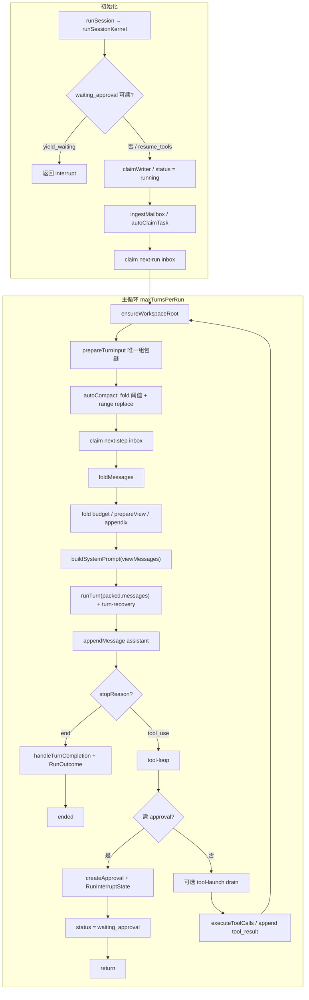
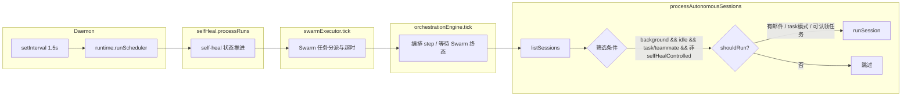
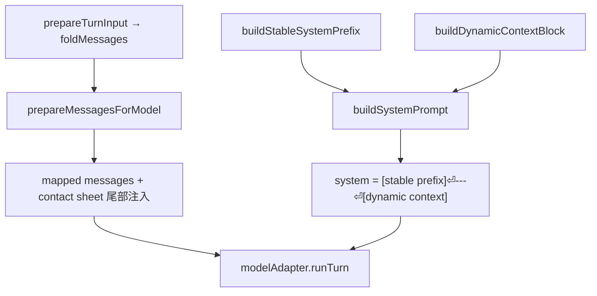
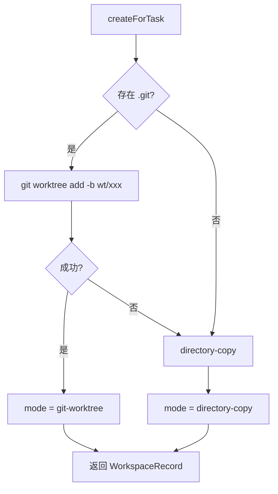
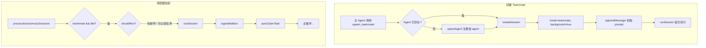
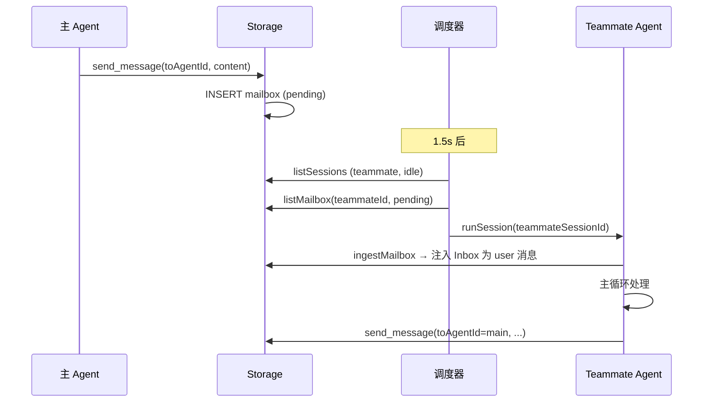
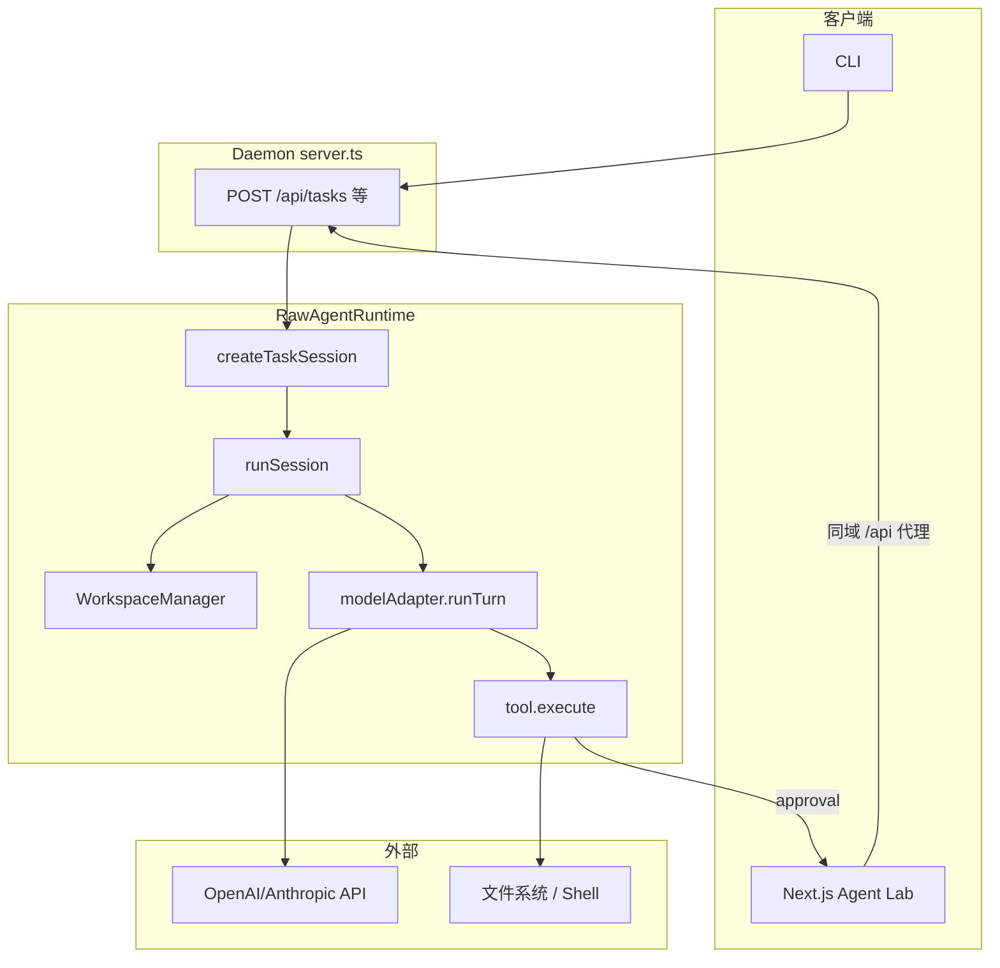
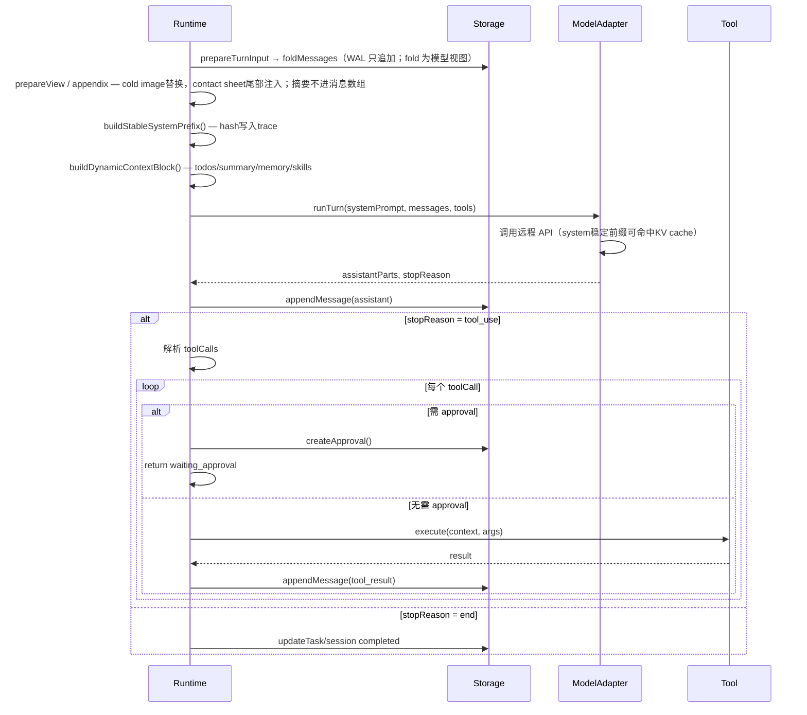

# Raw Agent SDK 项目架构

## 1. 概述

Raw Agent SDK 是一个类 Claude Code 风格的多智能体运行时，采用 Node.js 实现，包含本地 daemon、CLI、Web 控制台、SQLite 持久化、任务/工作区隔离、审批流程和团队编排能力。

## 2. 目录结构

```
ppeng-agent-core/
├── packages/
│   └── core/           # 核心运行时
│       ├── src/
│       │   ├── runtime.ts          # 主运行时（会话编排）
│       │   ├── storage.ts          # SQLite 持久化（Facade）
│       │   ├── stores/             # 领域存储 + 追踪
│       │   │   ├── session-store.ts
│       │   │   ├── image-asset-store.ts
│       │   │   ├── task-store.ts
│       │   │   ├── approval-store.ts
│       │   │   ├── mail-store.ts
│       │   │   ├── self-heal-store.ts
│       │   │   ├── background-job-store.ts
│       │   │   ├── misc-store.ts
│       │   │   ├── session-memory-store.ts
│       │   │   ├── storage-helpers.ts
│       │   │   ├── trace.ts           # 追踪事件写入
│       │   │   └── read-traces.ts     # 追踪事件读取
│       │   ├── model/              # 模型适配 + prompt 构建
│       │   │   ├── model-adapters.ts
│       │   │   ├── episodic-selection.ts
│       │   │   ├── cognitive-state.ts
│       │   │   ├── token-estimate.ts
│       │   │   └── prompt-builder.ts  # prompt 拼装
│       │   ├── tools/              # 内置工具（bash, read_file, grep …）
│       │   ├── skills/             # 技能注册 + 路由
│       │   │   ├── skill-matcher.ts   # 词法匹配 + 评分原语
│       │   │   ├── skill-router.ts    # 路由编排（mode/fusion/robustness）
│       │   │   ├── skill-registry.ts  # 磁盘 skill 扫描 + 解析
│       │   │   └── builtin-skills.ts  # 内置 skill 片段
│       │   ├── sandbox/            # OS 级沙箱 + 环境净化
│       │   │   ├── os-sandbox.ts      # macOS/Linux 沙箱提供者
│       │   │   └── env-sanitizer.ts   # Tier 0 环境变量净化
│       │   ├── self-heal/          # 自愈调度 + 执行器
│       │   ├── approval/           # 审批策略
│       │   ├── mcp/                # MCP 协议 + 连接管理
│       │   │   ├── mcp-jsonrpc.ts     # HTTP JSON-RPC 客户端
│       │   │   ├── mcp-stdio.ts       # stdio 服务器连接
│       │   │   └── mcp-manager.ts     # MCP 编排（从 runtime 提取）
│       │   ├── types.ts, errors.ts, env.ts, id.ts, logger.ts
│       │   └── index.ts
│       └── test/
│   └── capability-gateway/   # IM 入站（飞书/企微 bridge）+ 渠道出站 + RSS learn
│       └── src/              # 详见 doc/IM_AGENT_INTEGRATION.md
├── apps/
│   ├── daemon/         # HTTP API 服务
│   ├── cli/            # 终端客户端
│   └── web-console/    # Next.js Agent Lab 控制台
├── doc/                # 统一文档目录
├── package.json
└── .env.example
```

## 3. 模块架构

### 3.1 核心包 (packages/core)

| 模块 | 职责 |
|------|------|
| `runtime.ts` | L5 host 门面：MCP / mailbox / 审批 / 调度；`runSession` 委托 L3 `runSessionKernel`（文件仍厚，循环不在此） |
| `turn/` | L3：`prepareTurnInput`、`runSessionKernel`、recovery、tool-dispatch；子路径 `@ppeng/agent-core/turn` |
| `session/` | L1/L2：WAL `foldMessages` / `appendReplacement`、inbox、`runAutoCompact`、SteerAck、RunOutcome；`@ppeng/agent-core/session` |
| `loop.ts` | L4：`createAgentLoop` / `step` / `steer` / `fold`；`@ppeng/agent-core/loop` |
| `storage.ts` | SQLite 持久化，管理 agents/sessions/tasks/approvals/workspaces/mailbox |
| `model-adapters.ts` | 模型抽象：Heuristic / OpenAI 兼容 / Anthropic 兼容 |
| `tools.ts` | 内置工具（read_file, write_file, bash, TodoWrite, harness_write_spec 等） |
| `workspaces.ts` | 工作区创建：git-worktree 或 directory-copy |
| `builtin-agents.ts` | main / planner / generator / evaluator / researcher / implementer / reviewer / **self-healer** |
| `self-heal-policy.ts` / `self-heal-executors.ts` | 自愈策略（白名单 `npm run`、合并/重启辅助） |
| `builtin-skills.ts` | 内置 skill 片段与 `matchSkills`（如 Planning, Subagents, Guided learning）；磁盘 skills 见 `skill-registry.ts` |
| `skill-registry.ts` | 扫描 `skills/` 与 `~/.agents/**/SKILL.md`，解析 frontmatter，合并覆盖 |
| `skill-router.ts` | 词法 shortlist + `legacy` / `hybrid` 路由模式（环境变量可切）；基线说明见 `doc/skill-router-baseline.md` |

### 3.2 应用层

| 应用 | 职责 |
|------|------|
| `apps/daemon` | HTTP API、`/` 最小 stub 页、后台调度（每 1.5s 调用 runScheduler）；**不**再托管旧版控制台源码 |
| `apps/cli` | 通过 HTTP 调用 daemon，执行 chat/send/task/approve/**self-heal**/daemon-restart 等命令 |
| `apps/web-console` | **Next.js 15（App Router）**：浏览器访问 Next，REST/SSE 经同源 `/api/*` 由 `middleware.ts` 在**运行时**按 `DAEMON_PROXY_TARGET` 转发到 daemon；实现 Playground（流式、thinking、工具折叠、Markdown）、Ops/Teams/Trace/More 等；开发 `npm run dev:web-console`，生产 `npm run build:web-console` + `npm run start:web-console` |

### 3.3 Capability Gateway 与 IM

`packages/capability-gateway` 挂载在 daemon 的 `RAW_AGENT_GATEWAY_PREFIX` 路径下，提供飞书事件入站、企微 bridge、出站渠道（飞书机器人、企微群机器人、通用 webhook）及可选 RSS learn。**各 IM 能否「收消息驱动 Agent」**见专文 [`doc/IM_AGENT_INTEGRATION.md`](IM_AGENT_INTEGRATION.md)。

## 4. 数据模型

### 4.1 核心实体

```
Session (会话)
├── mode: chat | task | subagent | teammate
├── status: idle | running | waiting_approval | completed | failed
├── agentId, taskId?, workspaceId?, parentSessionId?
├── background: boolean
└── todo[], summary[]

SessionMessage / MessagePart（`session_messages` 只追加 WAL）
├── role: system | user | assistant | tool
├── parts: TextPart | ToolCallPart | ToolResultPart
├── seq（surface 顺序）/ surface_op: append | replace | hide
└── createdAt
    模型读 fold(surface)；审计 / UI 可读 listMessages（含被阴影行）。归档 jsonl 是冷存储，不是送模路径。

Task (任务)
├── status: pending | in_progress | completed | failed | cancelled
├── ownerAgentId?, blockedBy[]
├── workspaceId?
└── artifacts[]

Workspace (工作区)
├── mode: git-worktree | directory-copy
├── sourcePath, rootPath
└── taskId

Approval (审批)
├── toolName, args
├── status: pending | approved | rejected
└── sessionId

TaskEvent (任务事件)
├── taskId, kind, actor
├── payload: Record
└── createdAt

BackgroundJobRecord (后台任务)
├── sessionId, command
├── status: running | completed | error
└── result?
```

### 4.2 任务依赖 (blockedBy)

Task 支持 `blockedBy: string[]` 指定依赖的其他 task。当被依赖的 task 完成时，`unblockDependentTasks` 会移除其 id 并可能将依赖方状态置为 `pending`。

### 4.3 存储表 (SQLite)

- `agents` / `sessions` / `session_messages` / `tasks` / `task_events`
- `approvals` / `workspaces` / `mailbox` / `background_jobs`
- `self_heal_runs` / `self_heal_events` / `daemon_control`（自愈与重启握手）

### 4.4 TaskEvent 类型

| kind | 触发时机 |
|------|----------|
| `task.created` | createTask 时 |
| `workspace.bound` | ensureWorkspaceRoot 绑定工作区时 |
| `task.completed` | session 完成且 mode=task 时 |

## 5. 执行流程

### 5.1 会话执行 (runSession) — Agent 主循环

L5 `RawAgentRuntime.runSession` 只做同 session 并发闸，真正循环在 L3 `runSessionKernel`（`packages/core/src/turn/kernel.ts`；writer claim 也在 kernel 里）。**发给模型的数组**只来自 `prepareTurnInput` → `store.foldMessages`（再 view / appendix），不是 `listMessages().slice(-N)`，也没有独立的 `visibleMessages()` 送模函数。叙事真源：[`harness/00-self-built-agent-loop.md`](harness/00-self-built-agent-loop.md)；分层：[`AGENT_LOOP_LAYERING_PLAN.md`](AGENT_LOOP_LAYERING_PLAN.md)。


```mermaid
flowchart TB
    subgraph init [初始化]
        A[runSession → runSessionKernel] --> B{waiting_approval 可续?}
        B -->|yield_waiting| Z1[返回 interrupt]
        B -->|否 / resume_tools| C[claimWriter / status = running]
        C --> D[ingestMailbox / autoClaimTask]
        D --> E[claim next-run inbox]
    end

    subgraph loop [主循环 maxTurnsPerRun]
        E --> F[ensureWorkspaceRoot]
        F --> G["prepareTurnInput 唯一组包缝"]
        G --> G1[autoCompact: fold 阈值 + range replace]
        G1 --> G2[claim next-step inbox]
        G2 --> G3[foldMessages]
        G3 --> G4[fold budget / prepareView / appendix]
        G4 --> I["buildSystemPrompt(viewMessages)"]
        I --> J["runTurn(packed.messages) + turn-recovery"]
        J --> K[appendMessage assistant]
        K --> L{stopReason?}
        L -->|end| M[handleTurnCompletion + RunOutcome]
        M --> Z2[ended]
        L -->|tool_use| N[tool-loop]
        N --> O{需 approval?}
        O -->|是| P[createApproval + RunInterruptState]
        P --> Q[status = waiting_approval]
        Q --> Z3[return]
        O -->|否| R[可选 tool-launch drain]
        R --> S[executeToolCalls / append tool_result]
        S --> F
    end
```

`prepareTurnInput` 顺序（`turn/prepare-turn-input.ts`）：`autoCompact` → claim next-step → `foldMessages` → 可选 fold budget → `prepareView`（图像 / 拒答 / micro-compact）→ memory / working-log appendix。`ModelAdapter.runTurn` 只收该函数返回的 `messages`。Steer 默认进 inbox，正在飞的 HTTP 不改 body。

### 5.2 调度器 (runScheduler)

每 1.5 秒由 daemon 调用 `runtime.runScheduler()`，顺序为：**先** `selfHeal.processRuns()`（自愈状态机），**再** `swarmExecutor.tick()`（Swarm 协作，含超时标记），**再** `orchestrationEngine.tick()`（编排 step；`implement` 步等待关联 SwarmRun 终态），**最后** `processAutonomousSessions()`（background task/teammate，消费 `enqueueSchedulerWake` 队列）。Swarm 分派 teammate 后会 `enqueueSchedulerWake(sessionId, 'swarm.task')`。带 `metadata.selfHealControlled` 的 task 会话仅由自愈机驱动，避免与普通 task 自动轮询重复进入 `runSession`。


```mermaid
flowchart LR
    subgraph daemon [Daemon]
        A[setInterval 1.5s] --> B[runtime.runScheduler]
    end

    subgraph selfheal [selfHeal.processRuns]
        B --> SH[self-heal 状态推进]
    end

    subgraph swarmTick [swarmExecutor.tick]
        SH --> SW[Swarm 任务分派与超时]
    end

    subgraph orchTick [orchestrationEngine.tick]
        SW --> OR[编排 step / 等待 Swarm 终态]
    end

    subgraph scheduler [processAutonomousSessions]
        OR --> C[listSessions]
        C --> D{筛选条件}
        D -->|background && idle && task/teammate && 非selfHealControlled| E{shouldRun?}
        E -->|有邮件 / task模式 / 可认领任务| F[runSession]
        E -->|否| G[跳过]
    end
```

### 5.2.1 自愈（Self-heal）

- **HTTP**：`POST /api/self-heal/start`（body 可为 `{ "policy": { ... } }` 或与 policy 平铺的字段）、`GET /api/self-heal/status`、`GET /api/self-heal/runs`、`GET /api/self-heal/runs/:id`、`GET .../events`、`POST .../stop|resume`。
- **CLI**：`self-heal start|status|runs|show|logs|stop|resume`；合并并需换进程时 **`GET /api/daemon/restart-request`** + 人工重启 daemon 后 **`POST /api/daemon/restart-request/ack`**（`daemon restart-status` / `restart-ack`）。
- **流程**：`pending` → 创建带 `self-healer` 的 task + worktree → `running_tests`（仅白名单 `npm run`，由 `self-heal-executors` 执行）→ 失败则 `fixing`（单次 `runSession` 修复波）→ 再测；通过且 `autoMerge` 则主仓 `git merge` worktree 分支（directory-copy 工作区不支持自动合并）；`autoRestartDaemon` 时在 `daemon_control` 写入 `restart_request` 供外部 supervisor 处理。
- **并发**：同时仅允许一条进行中的自愈 run（第二条 `start` 返回 409）。

### 5.3 上下文压缩 (autoCompact)

压缩是 **WAL + fold + range replace**，不是「截最近 24 条当主路径、把旧行搬出 SQLite」。阈值看的是 **fold token**（经 prepareView 后的估计），不是 WAL 行数。

触发：`runAutoCompact`（`session/auto-compact.ts`）对比 `resolveHistoryTokenBudget('RAW_AGENT_COMPACT_TOKEN_THRESHOLD')`。显式 env 仍优先；未设时按模型窗口推导（`session/session-budget.ts`），**不再硬编码 24k**。打开的 tool 波次禁止 compact。

命中后：
1. 在 fold 上选一段**闭合** seq 区间（`selectClosedPrefixRange`；默认最近 `COMPACT_KEEP_RECENT=24` 条留在被替换前缀之外——这是 replace 切点，不是「模型只吃最近 24 条」）
2. `appendReplacement({ startSeq, endSeq })` 阴影该区间并挂摘要节点；**WAL 行仍在**
3. 若仍超预算：对最旧闭合 `tool_result` 做单 seq replace prune，不得假装 compact 成功后提前返回
4. **冷存储（可选）**：host 把被替换原文写到 `stateDir/transcripts/{sessionId}/*.jsonl`。归档供 working-log / 恢复锚点，**不是**送模路径
5. 更新 `session.summary`；下次请求摘要只出现在 **system prompt 动态上下文块**（§12）

模型输入始终是 `prepareTurnInput` → `foldMessages`（见 §5.1）。

### 5.4 Prompt 组装链路


```mermaid
flowchart TB
    A["prepareTurnInput → foldMessages"] --> B[prepareMessagesForModel]
    B --> C[mapped messages + contact sheet 尾部注入]
    D[buildStableSystemPrefix] --> E[buildSystemPrompt]
    F[buildDynamicContextBlock] --> E
    E --> G["system = [stable prefix]⏎---⏎[dynamic context]"]
    C --> H[modelAdapter.runTurn]
    G --> H
```

**稳定前缀**（跨轮不变）：agent 身份、固定规则、repo/workspace 路径、harness 角色文字。

**动态上下文**（每轮更新）：task 状态、todos、rolling summary、session_memory（上限 20 条/scope）、skill routing shortlist。

两者以 `\n\n---\n\n` 分隔，动态块在后，保证 provider 的 KV cache 前缀在同一会话内尽量复用。
每轮 `turn_start` trace 事件中写入 `stablePrefixHash`（16 位 hex），便于观测缓存命中情况。

### 5.4 后台任务 (bg_run)

`bg_run` 工具在 session 的 workspace（或 repoRoot）中 spawn 子进程执行命令。完成后：
- 更新 `background_jobs` 表 status、result
- 将输出作为 user 消息 append 到 session，触发下一轮 runSession

### 5.5 工作区创建


```mermaid
flowchart TD
    A[createForTask] --> B{存在 .git?}
    B -->|是| C[git worktree add -b wt/xxx]
    C --> D{成功?}
    D -->|是| E[mode = git-worktree]
    D -->|否| F[directory-copy]
    B -->|否| F
    F --> G[mode = directory-copy]
    E --> H[返回 WorkspaceRecord]
    G --> H
```

## 6. 模型适配器

| 适配器 | 用途 | 配置 |
|--------|------|------|
| `heuristic` | 本地无密钥模式，简单规则回复 | 默认 |
| `openai-compatible` | OpenAI 兼容 chat completions | RAW_AGENT_BASE_URL, API_KEY, MODEL_NAME |
| `anthropic-compatible` | Anthropic API；自动在 system 添加 `cache_control: ephemeral` 以启用 prompt cache | RAW_AGENT_ANTHROPIC_URL, API_KEY, MODEL_NAME |
| `hybrid-router`（组合） | 消息中含 `image` part 时走 VL，否则走文本模型 | 配置 `RAW_AGENT_VL_*` 后由 `createModelAdapterFromEnv` 自动包装 |

工具定义按名称字母序排列，工具调用参数使用 canonical JSON（键字典序），保证 tool payload 在同一工具集下跨轮字节稳定。参见 `doc/PROMPT_CACHE.md` 了解完整缓存策略。

**用量与截断可观测性（usage & truncation）**：`ModelTurnResult` 除 `assistantParts`/`stopReason` 外，还携带可选的 `usage`（归一化的 `TokenUsage`：input/output/total/可选 cachedInput/requests）、`finishReason`（provider 原始 stop/finish 值）与 `truncated`（被 token 上限截断）。归一化纯函数在 `packages/core/src/model/usage.ts`（`normalizeOpenAiUsage` 覆盖 chat.completions 与 `/v1/responses` 两种字段；`normalizeAnthropicUsage` 把 `cache_read_input_tokens` 折进 inputTokens；`isTruncatedFinish` 识别 `length`/`max_tokens`/`max_output_tokens`/`incomplete`；`mergeUsage` 会话级累加）。chat 流式请求带 `stream_options.include_usage` 以获取末尾 usage-only chunk。runtime 在 `turn_end` trace 写入 `usage`/`finishReason`，被截断时另发 `turn_truncated` trace（避免截断轮被当作干净完成），并把会话累计写入 `session.metadata.usageTotals`。**这是纯观测：不因截断改写 `stopReason` 或强行续写**。

**上游 request-id**：`ModelTurnResult.requestId?` 由 `packages/core/src/model/upstream-request-id.ts` 从响应 header（`x-request-id` 等）或 JSON/SSE body（`request_id` / `id`，含嵌套 error 串）提取；adapter 的 `postJson` 与流式路径填充，runtime `turn_end` 透传。用于与网关 / 模型侧日志对账。**纯观测**。

**Stable system 版本指纹**：`STABLE_SYSTEM_VERSION`（`prompt-builder.ts`）随 `turn_end` 下发，**不进 prompt、不进 cache key**；改 `buildStablePrefix` 文案时同步 bump（纪律见 `packages/core/src/model/AGENTS.md`）。

**Optional tool groups 默认并集**：`RAW_AGENT_DEFAULT_ENABLED_OPTIONAL_GROUPS`（CSV）与会话 `enabledOptionalToolGroups` 取并集后再过滤；feature flag `RAW_AGENT_OPTIONAL_TOOL_GROUPS=1` 开启时生效。

**Tool result 回流脱敏**：`sandbox/result-redaction.ts` 在 bash / bg_* / work_evidence 结果回写前，将敏感 env 值替换为 `[REDACTED:<NAME>]`（精确表 + `_*TOKEN|SECRET|API_KEY|COOKIE…` 后缀，值长 ≥ 6）。

**Unknown-tool 协议自愈**：未知工具名返回结构化 JSON（`did_you_mean` / `available_tools_sample` / `hint`），保证 tool_call 有配对 result，模型可改名重试。

**Recovery AdvisoryGrace**：`SessionLoopGuard` 触发 abort 前默认宽限 1 轮（`RAW_AGENT_RECOVERY_ADVISORY_GRACE_BUDGET`），注入 `[recovery-advisory]` system 消息并继续；耗尽后硬停。Trace：`recovery_advisory` / `recovery_abort`。

**Goal soft-gate**：会话 `metadata.goalCondition` 激活；软完成汇合点调用 `GoalGate.evaluate`（`completeText` JSON 判官，fail-open）；未达成则 system 续轮。见 `packages/core/src/goal/`。

**RiskEngine + AdvisoryQueue**：工具错误连击 / iteration 告急 / token 预算等信号 → 入队 → 下轮 drain 为 system advisory。

**Case governance**：`agent_cases.status|half_life_days|expires_at`（schema v10）；`runCaseGovernance` 在 `runSession` 入口 decay/archive/capacity。

**Memory user appendix**：`buildMemoryAppendix` 拼到最近 user 消息前缀，system 只保留 stable+dynamic（prefix cache）。

**Token→USD**：`estimateUsageCostUsd` → `turn_end.costUsd` + `session.metadata.usageCostUsd`。

**视觉与图片**：会话消息支持 `ImagePart`（引用 `image_assets` 表，文件落在 `stateDir/images/<session>/`）。Daemon 提供 `POST /api/sessions/:id/images/ingest-base64` 与 `.../fetch-url`。含图用户轮默认经 router 调用 VL。内置工具 `vision_analyze` 在有 `RAW_AGENT_VL_MODEL_NAME` 时对指定 `asset_ids` 做额外 VL 调用。热图数量超限时，`maintainImageRetention` 可将旧图压为 contact sheet（`sharp`），更新 `session.metadata.imageWarmContactAssetId`，并把过期的原图标记为 `cold`。

**Subagent 角色映射**：`spawn_subagent(prompt, role)` 中 `research`→researcher、`implement`→implementer、`review`→reviewer、`planner`→planner、`generator`→generator、`evaluator`→evaluator，否则用父 agent。

### 6.1 长运行 Harness（对齐 Anthropic planner / generator / evaluator）

- **Planner**：短提示扩展为高层产品说明与功能边界；用 `harness_write_spec(kind=product_spec)` 写入 `.raw-agent-harness/product_spec.md`；可用 `task_create` + `blockedBy` 排期。
- **Generator**：一次一个 sprint/功能；实现前用 `harness_write_spec(kind=sprint_contract)` 写可验收的 sprint 合约；实现后优先 `spawn_subagent(role=evaluator)` 做外部质检。
- **Evaluator**：独立、偏怀疑的 QA；`harness_write_spec(kind=evaluator_feedback)` 记录结论。
- **上下文**：仍依赖现有 `autoCompact` + `session.summary`；结构化 Markdown 作为跨压缩/子会话 handoff 的补充。
- **环境**：`RAW_AGENT_MAX_TURNS` 可提高单轮 `runSession` 的 turn 上限（长 sprint）。

## 7. 内置工具（37 个，另可选 3 个 external-ai）

清单以源码为准：`packages/core/src/tools/builtin-tools.ts` 中 `createBuiltinTools`；可用 `node scripts/doc-sync-tools.mjs` 打印当前列表。

| 类别 | 工具名（节选） |
|------|----------------|
| 文件/搜索 | `read_file`, `grep_files`, `glob_files`, `write_file`, `edit_file`, `bash`, `workspace_list` |
| 网络/视觉 | `web_fetch`, `web_search`, `vision_analyze` |
| 记忆 | `memory_set`, `memory_get`, `memory_delete`, `handoff_state`（对话回路经 `AgentMemoryStore`） |
| 任务/协作 | `task_*`, `spawn_subagent`, `spawn_teammate`, `list_team`, `send_message`, `read_inbox` |
| Harness | `harness_write_spec`, `record_summary`, `TodoWrite`, `work_evidence` |
| 其他 | `load_skill`, `bg_run`, `bg_check`, `lsp_request`, `notebook_edit`, `spill_tool_result`, `retrieve_tool_result`, `schedule_social_post`, `a2ui_render`, `a2ui_delete_surface` |

设 `RAW_AGENT_EXTERNAL_AI_TOOLS=1` 时额外挂载：`claude_code`, `codex_exec`, `cursor_agent`。

## 8. Teams 与 Teammate 编排

### 8.1 概念

| 模式 | 说明 | 执行方式 |
|------|------|----------|
| **subagent** | 同步子 agent，父会话等待子完成 | `spawn_subagent` 调用后阻塞，子 runSession 结束才返回 |
| **teammate** | 异步 teammate，后台持续运行 | `spawn_teammate` 创建 session(background=true)，由调度器周期性拉起 |

Teammate 用于可并行、可拆分的协作任务；通过 **Mailbox** 在 agent 间异步传递消息。

### 8.2 核心组件

- **Mailbox**：SQLite 表 `mailbox`，字段 `from_agent_id`、`to_agent_id`、`type`、`content`、`correlation_id`、`status`(pending/read)
- **send_message**：向指定 agent 发消息，写入 mailbox
- **read_inbox**：读取当前 agent 的收件箱（工具调用）
- **ingestMailbox**：`runSession` 启动时，将 pending 邮件注入为 user 消息
- **autoClaimTask**：teammate 模式下，自动认领无主且无依赖的 pending 任务

### 8.3 Teammate 生命周期


```mermaid
flowchart TB
    subgraph spawn [创建 Teammate]
        A[主 Agent 调用 spawn_teammate] --> B{Agent 已存在?}
        B -->|否| C[upsertAgent 注册新 agent]
        B -->|是| D[createSession]
        C --> D
        D --> E[mode=teammate, background=true]
        E --> F[appendMessage 初始 prompt]
        F --> G[runSession 首次执行]
    end

    subgraph schedule [调度器拉起]
        H[processAutonomousSessions] --> I{teammate && idle?}
        I -->|是| J{shouldRun?}
        J -->|有邮件 / 可认领任务| K[runSession]
        K --> L[ingestMailbox]
        L --> M[autoClaimTask]
        M --> N[主循环...]
    end
```

### 8.4 Agent 间消息流


```mermaid
sequenceDiagram
    participant Main as 主 Agent
    participant Store as Storage
    participant Scheduler as 调度器
    participant Teammate as Teammate Agent

    Main->>Store: send_message(toAgentId, content)
    Store->>Store: INSERT mailbox (pending)

    Note over Scheduler: 1.5s 后
    Scheduler->>Store: listSessions (teammate, idle)
    Scheduler->>Store: listMailbox(teammateId, pending)
    Scheduler->>Teammate: runSession(teammateSessionId)

    Teammate->>Store: ingestMailbox → 注入 Inbox 为 user 消息
    Teammate->>Teammate: 主循环处理
    Teammate->>Store: send_message(toAgentId=main, ...)
```

### 8.5 数据模型补充

```
MailRecord (mailbox 表)
├── fromAgentId, toAgentId
├── type, content
├── correlationId?, sessionId?, taskId?
├── status: pending | read
└── createdAt, readAt?
```

## 9. Daemon API

| 方法 | 路径 | 说明 |
|------|------|------|
| GET | `/api/health` | 健康检查 |
| GET | `/api/sessions` | 会话列表 |
| POST | `/api/chat` | 创建 chat 或发送消息并执行 |
| POST | `/api/sessions` | 创建 chat/task 会话 |
| POST | `/api/sessions/:id/messages` | 发送消息 |
| GET | `/api/sessions/:id` | 会话详情 |
| GET | `/api/tasks` | 任务列表 |
| POST | `/api/tasks` | 创建任务 |
| GET | `/api/tasks/:id` | 任务详情 + events |
| POST | `/api/scheduler/run` | 手动触发调度 |
| GET | `/api/agents` | Agent 列表 |
| GET | `/api/approvals` | 审批列表 |
| POST | `/api/approvals/:id/approve` | 批准（session 变 idle 并注入 user 消息；background 会话由调度器自动拉起） |
| POST | `/api/approvals/:id/reject` | 拒绝 |
| GET | `/api/workspaces` | 工作区列表 |
| GET | `/api/background-jobs` | 后台任务列表 |

**控制台入口**：日常开发/使用请启动 **Next**（见根 `package.json` 的 `dev:web-console` / `start:web-console`）。Daemon 仅对 `/` 返回 `apps/daemon/web-stub/index.html`（提示指向 Next），业务 API 仍为 `/api/*`。

**代理**：Next `middleware` 将 `/api/*` 代理到 `DAEMON_PROXY_TARGET`（如 `http://127.0.0.1:37070`），避免 build 期固化端口；浏览器侧始终请求相对路径 `/api/...`。

### 9.1 CLI 命令

| 命令 | 说明 |
|------|------|
| `chat <message>` | 创建 chat 会话并执行 |
| `send <sessionId> <message>` | 向已有会话发消息 |
| `session ls` | 列出会话 |
| `session show <sessionId>` | 查看会话详情与消息 |
| `task create <title> [description]` | 创建任务 |
| `task ls` | 列出任务 |
| `task show <taskId>` | 查看任务详情与 events |
| `approve <approvalId> [approve/reject]` | 审批 |
| `agent ls` | 列出 Agent |
| `workspace ls` | 列出工作区 |
| `scheduler run` | 手动触发调度 |

### 9.2 环境变量

| 变量 | 说明 | 默认 |
|------|------|------|
| `RAW_AGENT_STATE_DIR` | 状态目录 | `.agent-state` |
| `RAW_AGENT_DAEMON_HOST` | Daemon 监听地址 | `127.0.0.1` |
| `RAW_AGENT_DAEMON_PORT` | Daemon 端口 | `37070` |
| `RAW_AGENT_MODEL_PROVIDER` | 模型提供商 | `heuristic` |
| `RAW_AGENT_MODEL_NAME` | 模型名称 | - |
| `RAW_AGENT_API_KEY` | API Key | - |
| `RAW_AGENT_BASE_URL` | OpenAI 兼容 API 地址 | - |
| `RAW_AGENT_ANTHROPIC_URL` | Anthropic API 地址 | - |
| `RAW_AGENT_USE_JSON_MODE` | 第三方 API 不支持 response_format 时设为 `0` | - |
| `RAW_AGENT_MAX_TURNS` | 单次 `runSession` 最大模型轮数（长 sprint 可调大） | `24` |

## 10. 数据流

### 10.1 请求到执行链路


```mermaid
flowchart TB
    subgraph client [客户端]
        CLI[CLI]
        Web[Next.js Agent Lab]
    end

    subgraph daemon [Daemon server.ts]
        API[POST /api/tasks 等]
    end

    Web -->|同域 /api 代理| API

    subgraph runtime [RawAgentRuntime]
        Create[createTaskSession]
        Run[runSession]
        WM[WorkspaceManager]
        MA[modelAdapter.runTurn]
        Tools[tool.execute]
    end

    subgraph external [外部]
        LLM[OpenAI/Anthropic API]
        FS[文件系统 / Shell]
    end

    CLI --> API
    API --> Create
    Create --> Run
    Run --> WM
    Run --> MA
    MA --> LLM
    MA --> Tools
    Tools --> FS
    Tools -->|approval| Web
```

### 10.2 单轮 Turn 内部流程


```mermaid
sequenceDiagram
    participant R as Runtime
    participant S as Storage
    participant M as ModelAdapter
    participant T as Tool

    R->>S: prepareTurnInput → foldMessages（WAL 只追加；fold 为模型视图）
    R->>R: prepareView / appendix — cold image替换，contact sheet尾部注入；摘要不进消息数组
    R->>R: buildStableSystemPrefix() — hash写入trace
    R->>R: buildDynamicContextBlock() — todos/summary/memory/skills
    R->>M: runTurn(systemPrompt, messages, tools)
    M->>M: 调用远程 API（system稳定前缀可命中KV cache）
    M-->>R: assistantParts, stopReason
    R->>S: appendMessage(assistant)

    alt stopReason = tool_use
        R->>R: 解析 toolCalls
        loop 每个 toolCall
            alt 需 approval
                R->>S: createApproval()
                R->>R: return waiting_approval
            else 无需 approval
                R->>T: execute(context, args)
                T-->>R: result
                R->>S: appendMessage(tool_result)
            end
        end
    else stopReason = end
        R->>S: updateTask/session completed
    end
```

## 11. 扩展点

- **模型**：实现 `ModelAdapter` 接口，替换 `createModelAdapterFromEnv`
- **工具**：实现 `ToolContract`，传入 `RuntimeOptions.tools`
- **Agent**：`RuntimeOptions.agents` 覆盖默认 builtin
- **Skill**：在 `skills/` 目录放置 `SKILL.md`（含 frontmatter），自动加载

## 12. Prompt Cache 架构

详见 `doc/PROMPT_CACHE.md`。核心原则：

- **稳定前缀**：`buildStableSystemPrefix` 输出 agent 身份 + 固定规则，不含任何运行时动态值。
- **动态上下文**：`buildDynamicContextBlock` 输出 todos、summary、memory、skill routing，置于分隔符 `---` 之后。
- **摘要单一入口**：`session.summary` 仅注入动态上下文块；compact 用 fold 上的 `appendReplacement`，不再经已删除的 `visibleMessages()` 往消息数组塞合成 `system`。
- **消息数组稳定性**：contact sheet 在消息数组尾部（最后一条 user 消息之前）注入，避免改变历史消息索引。
- **工具 payload 稳定性**：工具定义按名称排序，工具调用参数使用 canonical JSON（键字典序）。
- **Anthropic 显式缓存**：`anthropic-compatible` adapter 将 system 转为 content 块并加 `cache_control: ephemeral`。
- **观测**：每轮 `turn_start` trace 事件写入 `stablePrefixHash`（16 位 hex），便于日志分析缓存命中率。
