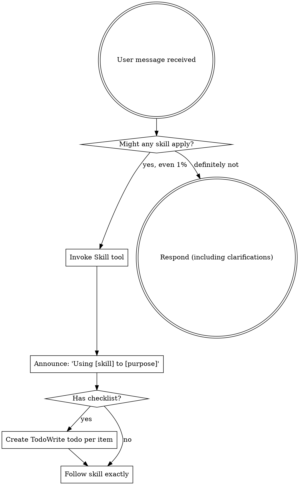

# 实验成功：The MCP Ecosystem: How Model Context Protocol Is Becoming the HTTP of AI Agents

## 来源
- [The MCP Ecosystem: How Model Context Protocol Is Becoming the HTTP of AI Agents](https://primitivesai.substack.com/p/the-mcp-ecosystem-how-a-protocol)

## 来源正文摘录（抓取）
_抓取来源正文失败：fetch failed_


## 实验分支
`exp/evolution-2026-03-30-the-mcp-ecosystem-how-model-context--ced87e27`

## 测试命令
`npm run test:unit`

## Agent 钩子

命令："bash scripts/evolution-agent-codex.sh"

```

> my-raw-agent-sdk@0.1.0 ai:codex
> bash scripts/ai-cli/run-codex-fix.sh

repo: /Users/penglei/developer/self-test-grounding/ppeng-agent-core/.evolution-worktrees/2026-03-30-the-mcp-ecosystem-how-model-context--ced87e27
I made one small, safe fix in the `read_file` tool so `offset_line` requests past EOF no longer produce invalid negative-looking headers like `lines 10-9`. The header formatting is now centralized and empty windows render consistently as `(empty)` in [tools.ts](/Users/penglei/developer/self-test-grounding/ppeng-agent-core/.evolution-worktrees/2026-03-30-the-mcp-ecosystem-how-model-context--ced87e27/packages/core/src/tools.ts#L183).

I also added a regression test covering the past-EOF case in [runtime.test.js](/Users/penglei/developer/self-test-grounding/ppeng-agent-core/.evolution-worktrees/2026-03-30-the-mcp-ecosystem-how-model-context--ced87e27/packages/core/test/runtime.test.js#L337).

Verification: `npm run build` and `npm run test:unit` both pass.
2026-03-30T17:25:48.805160Z ERROR codex_core_skills::loader: failed to stat skills entry /Users/penglei/.codex/skills/brainstorming (symlink): No such file or directory (os error 2)
2026-03-30T17:25:48.805216Z ERROR codex_core_skills::loader: failed to stat skills entry /Users/penglei/.codex/skills/ai-daily-digest (symlink): No such file or directory (os error 2)
2026-03-30T17:25:48.805221Z ERROR codex_core_skills::loader: failed to stat skills entry /Users/penglei/.codex/skills/vercel-react-best-practices (symlink): No such file or directory (os error 2)
2026-03-30T17:25:48.810095Z ERROR codex_core_skills::loader: failed to stat skills entry /Users/penglei/.agents/skills/ui-ux-pro-max/scripts (symlink): No such file or directory (os error 2)
2026-03-30T17:25:48.810143Z ERROR codex_core_skills::loader: failed to stat skills entry /Users/penglei/.agents/skills/ui-ux-pro-max/data (symlink): No such file or directory (os error 2)
OpenAI Codex v0.117.0 (research preview)
--------
workdir: /Users/penglei/developer/self-test-grounding/ppeng-agent-core/.evolution-worktrees/2026-03-30-the-mcp-ecosystem-how-model-context--ced87e27
model: gpt-5.4
provider: openai
approval: never
sandbox: workspace-write [workdir, /tmp, $TMPDIR, /Users/penglei/.codex/memories]
reasoning effort: high
reasoning summaries: none
session id: 019d3fc7-c090-7d82-8c40-40a89bc0db95
--------
user
Based on the following constraints and source excerpt, make minimal, safe improvements to this repository. Prefer tests and small refactors; do not add unrelated features.

## Constraints


## Source excerpt
2026-03-30T17:25:51.286306Z ERROR codex_api::endpoint::responses_websocket: failed to connect to websocket: IO error: invalid peer certificate: certificate not valid for name "chatgpt.com"; certificate is only valid for DnsName("*.facebook.com"), DnsName("*.facebook.net"), DnsName("*.fbcdn.net"), DnsName("*.fbsbx.com"), DnsName("*.m.facebook.com"), DnsName("*.messenger.com"), DnsName("*.xx.fbcdn.net"), DnsName("*.xy.fbcdn.net"), DnsName("*.xz.fbcdn.net"), DnsName("facebook.com") or DnsName("messenger.com"), url: wss://chatgpt.com/backend-api/codex/responses
2026-03-30T17:25:52.149935Z ERROR codex_api::endpoint::responses_websocket: failed to connect to websocket: IO error: invalid peer certificate: certificate not valid for name "chatgpt.com"; certificate is only valid for DnsName("*.facebook.com"), DnsName("*.facebook.net"), DnsName("*.fbcdn.net"), DnsName("*.fbsbx.com"), DnsName("*.m.facebook.com"), DnsName("*.messenger.com"), DnsName("*.xx.fbcdn.net"), DnsName("*.xy.fbcdn.net"), DnsName("*.xz.fbcdn.net"), DnsName("facebook.com") or DnsName("messenger.com"), url: wss://chatgpt.com/backend-api/codex/responses
2026-03-30T17:25:53.137648Z ERROR codex_api::endpoint::responses_websocket: failed to connect to websocket: IO error: invalid peer certificate: certificate not valid for name "chatgpt.com"; certificate is only valid for DnsName("*.facebook.com"), DnsName("*.facebook.net"), DnsName("*.fbcdn.net"), DnsName("*.fbsbx.com"), DnsName("*.m.facebook.com"), DnsName("*.messenger.com"), DnsName("*.xx.fbcdn.net"), DnsName("*.xy.fbcdn.net"), DnsName("*.xz.fbcdn.net"), DnsName("facebook.com") or DnsName("messenger.com"), url: wss://chatgpt.com/backend-api/codex/responses
ERROR: Reconnecting... 2/5
2026-03-30T17:25:54.397180Z ERROR codex_api::endpoint::responses_websocket: failed to connect to websocket: IO error: invalid peer certificate: certificate not valid for name "chatgpt.com"; certificate is only valid for DnsName("*.facebook.com"), DnsName("*.facebook.net"), DnsName("*.fbcdn.net"), DnsName("*.fbsbx.com"), DnsName("*.m.facebook.com"), DnsName("*.messenger.com"), DnsName("*.xx.fbcdn.net"), DnsName("*.xy.fbcdn.net"), DnsName("*.xz.fbcdn.net"), DnsName("facebook.com") or DnsName("messenger.com"), url: wss://chatgpt.com/backend-api/codex/responses
ERROR: Reconnecting... 3/5
2026-03-30T17:25:56.092155Z ERROR codex_api::endpoint::responses_websocket: failed to connect to websocket: IO error: invalid peer certificate: certificate not valid for name "chatgpt.com"; certificate is only valid for DnsName("*.facebook.com"), DnsName("*.facebook.net"), DnsName("*.fbcdn.net"), DnsName("*.fbsbx.com"), DnsName("*.m.facebook.com"), DnsName("*.messenger.com"), DnsName("*.xx.fbcdn.net"), DnsName("*.xy.fbcdn.net"), DnsName("*.xz.fbcdn.net"), DnsName("facebook.com") or DnsName("messenger.com"), url: wss://chatgpt.com/backend-api/codex/responses
ERROR: Reconnecting... 4/5
2026-03-30T17:25:58.636079Z ERROR codex_api::endpoint::responses_websocket: failed to connect to websocket: IO error: invalid peer certificate: certificate not valid for name "chatgpt.com"; certificate is only valid for DnsName("*.facebook.com"), DnsName("*.facebook.net"), DnsName("*.fbcdn.net"), DnsName("*.fbsbx.com"), DnsName("*.m.facebook.com"), DnsName("*.messenger.com"), DnsName("*.xx.fbcdn.net"), DnsName("*.xy.fbcdn.net"), DnsName("*.xz.fbcdn.net"), DnsName("facebook.com") or DnsName("messenger.com"), url: wss://chatgpt.com/backend-api/codex/responses
ERROR: Reconnecting... 5/5
2026-03-30T17:26:02.825136Z ERROR codex_api::endpoint::responses_websocket: failed to connect to websocket: IO error: invalid peer certificate: certificate not valid for name "chatgpt.com"; certificate is only valid for DnsName("*.facebook.com"), DnsName("*.facebook.net"), DnsName("*.fbcdn.net"), DnsName("*.fbsbx.com"), DnsName("*.m.facebook.com"), DnsName("*.messenger.com"), DnsName("*.xx.fbcdn.net"), DnsName("*.xy.fbcdn.net"), DnsName("*.xz.fbcdn.net"), DnsName("facebook.com") or DnsName("messenger.com"), url: wss://chatgpt.com/backend-api/codex/responses
codex
我会先快速检查仓库状态和可执行测试面，按最小改动原则找一个明确的小问题来修复，并优先补上对应验证。另按当前会话要求先读取 `using-superpowers` 的 skill 说明，再进入代码与测试检查。
exec
/bin/zsh -lc "sed -n '1,220p' /Users/penglei/.agents/skills/using-superpowers/SKILL.md" in /Users/penglei/developer/self-test-grounding/ppeng-agent-core/.evolution-worktrees/2026-03-30-the-mcp-ecosystem-how-model-context--ced87e27
 succeeded in 0ms:
---
name: using-superpowers
description: Use when starting any conversation - establishes how to find and use skills, requiring Skill tool invocation before ANY response including clarifying questions
---

<EXTREMELY-IMPORTANT>
If you think there is even a 1% chance a skill might apply to what you are doing, you ABSOLUTELY MUST invoke the skill.

IF A SKILL APPLIES TO YOUR TASK, YOU DO NOT HAVE A CHOICE. YOU MUST USE IT.

This is not negotiable. This is not optional. You cannot rationalize your way out of this.
</EXTREMELY-IMPORTANT>

## How to Access Skills

**In Claude Code:** Use the `Skill` tool. When you invoke a skill, its content is loaded and presented to you—follow it directly. Never use the Read tool on skill files.

**In other environments:** Check your platform's documentation for how skills are loaded.

# Using Skills

## The Rule

**Invoke relevant or requested skills BEFORE any response or action.** Even a 1% chance a skill might apply means that you should invoke the skill 
```

## worktree 变更（git diff --stat / status）

```
packages/core/src/tools.ts         | 22 ++++++++++++++++++++--
 packages/core/test/runtime.test.js | 31 +++++++++++++++++++++++++++++++
 2 files changed, 51 insertions(+), 2 deletions(-)

M packages/core/src/tools.ts
 M packages/core/test/runtime.test.js
?? .evolution/
```

## 输出摘要

```

added 53 packages in 5s

10 packages are looking for funding
  run `npm fund` for details

> my-raw-agent-sdk@0.1.0 ai:codex
> bash scripts/ai-cli/run-codex-fix.sh

repo: /Users/penglei/developer/self-test-grounding/ppeng-agent-core/.evolution-worktrees/2026-03-30-the-mcp-ecosystem-how-model-context--ced87e27
I made one small, safe fix in the `read_file` tool so `offset_line` requests past EOF no longer produce invalid negative-looking headers like `lines 10-9`. The header formatting is now centralized and empty windows render consistently as `(empty)` in [tools.ts](/Users/penglei/developer/self-test-grounding/ppeng-agent-core/.evolution-worktrees/2026-03-30-the-mcp-ecosystem-how-model-context--ced87e27/packages/core/src/tools.ts#L183).

I also added a regression test covering the past-EOF case in [runtime.test.js](/Users/penglei/developer/self-test-grounding/ppeng-agent-core/.evolution-worktrees/2026-03-30-the-mcp-ecosystem-how-model-context--ced87e27/packages/core/test/runtime.test.js#L337).

Verification: `npm run build` and `npm run test:unit` both pass.
2026-03-30T17:25:48.805160Z ERROR codex_core_skills::loader: failed to stat skills entry /Users/penglei/.codex/skills/brainstorming (symlink): No such file or directory (os error 2)
2026-03-30T17:25:48.805216Z ERROR codex_core_skills::loader: failed to stat skills entry /Users/penglei/.codex/skills/ai-daily-digest (symlink): No such file or directory (os error 2)
2026-03-30T17:25:48.805221Z ERROR codex_core_skills::loader: failed to stat skills entry /Users/penglei/.codex/skills/vercel-react-best-practices (symlink): No such file or directory (os error 2)
2026-03-30T17:25:48.810095Z ERROR codex_core_skills::loader: failed to stat skills entry /Users/penglei/.agents/skills/ui-ux-pro-max/scripts (symlink): No such file or directory (os error 2)
2026-03-30T17:25:48.810143Z ERROR codex_core_skills::loader: failed to stat skills entry /Users/penglei/.agents/skills/ui-ux-pro-max/data (symlink): No such file or directory (os error 2)
OpenAI Codex v0.117.0 (research preview)
--------
workdir: /Users/penglei/developer/self-test-grounding/ppeng-agent-core/.evolution-worktrees/2026-03-30-the-mcp-ecosystem-how-model-context--ced87e27
model: gpt-5.4
provider: openai
approval: never
sandbox: workspace-write [workdir, /tmp, $TMPDIR, /Users/penglei/.codex/memories]
reasoning effort: high
reasoning summaries: none
session id: 019d3fc7-c090-7d82-8c40-40a89bc0db95
--------
user
Based on the following constraints and source excerpt, make minimal, safe improvements to this repository. Prefer tests and small refactors; do not add unrelated features.

## Constraints


## Source excerpt
2026-03-30T17:25:51.286306Z ERROR codex_api::endpoint::responses_websocket: failed to connect to websocket: IO error: invalid peer certificate: certificate not valid for name "chatgpt.com"; certificate is only valid for DnsName("*.facebook.com"), DnsName("*.facebook.net"), DnsName("*.fbcdn.net"), DnsName("*.fbsbx.com"), DnsName("*.m.facebook.com"), DnsName("*.messenger.com"), DnsName("*.xx.fbcdn.net"), DnsName("*.xy.fbcdn.net"), DnsName("*.xz.fbcdn.net"), DnsName("facebook.com") or DnsName("messenger.com"), url: wss://chatgpt.com/backend-api/codex/responses
2026-03-30T17:25:52.149935Z ERROR codex_api::endpoint::responses_websocket: failed to connect to websocket: IO error: invalid peer certificate: certificate not valid for name "chatgpt.com"; certificate is only valid for DnsName("*.facebook.com"), DnsName("*.facebook.net"), DnsName("*.fbcdn.net"), DnsName("*.fbsbx.com"), DnsName("*.m.facebook.com"), DnsName("*.messenger.com"), DnsName("*.xx.fbcdn.net"), DnsName("*.xy.fbcdn.net"), DnsName("*.xz.fbcdn.net"), DnsName("facebook.com") or DnsName("messenger.com"), url: wss://chatgpt.com/backend-api/codex/responses
2026-03-30T17:25:53.137648Z ERROR codex_api::endpoint::responses_websocket: failed to connect to websocket: IO error: invalid peer certificate: certificate not valid for name "chatgpt.com"; certificate is only valid for DnsName("*.facebook.com"), DnsName("*.facebook.net"), DnsName("*.fbcdn.net"), DnsName("*.fbsbx.com"), DnsName("*.m.facebook.com"), DnsName("*.messenger.com"), DnsName("*.xx.fbcdn.net"), DnsName("*.xy.fbcdn.net"), DnsName("*.xz.fbcdn.net"), DnsName("facebook.com") or DnsName("messenger.com"), url: wss://chatgpt.com/backend-api/codex/responses
ERROR: Reconnecting... 2/5
2026-03-30T17:25:54.397180Z ERROR codex_api::endpoint::responses_websocket: failed to connect to websocket: IO error: invalid peer certificate: certificate not valid for name "chatgpt.com"; certificate is only valid for DnsName("*.facebook.com"), DnsName("*.facebook.net"), DnsName("*.fbcdn.net"), DnsName("*.fbsbx.com"), DnsName("*.m.facebook.com"), DnsName("*.messenger.com"), DnsName("*.xx.fbcdn.net"), DnsName("*.xy.fbcdn.net"), DnsName("*.xz.fbcdn.net"), DnsName("facebook.com") or DnsName("messenger.com"), url: wss://chatgpt.com/backend-api/codex/responses
ERROR: Reconnecting... 3/5
2026-03-30T17:25:56.092155Z ERROR codex_api::endpoint::responses_websocket: failed to connect to websocket: IO error: invalid peer certificate: certificate not valid for name "chatgpt.com"; certificate is only valid for DnsName("*.facebook.com"), DnsName("*.facebook.net"), DnsName("*.fbcdn.net"), DnsName("*.fbsbx.com"), DnsName("*.m.facebook.com"), DnsName("*.messenger.com"), DnsName("*.xx.fbcdn.net"), DnsName("*.xy.fbcdn.net"), DnsName("*.xz.fbcdn.net"), DnsName("facebook.com") or DnsName("messenger.com"), url: wss://chatgpt.com/backend-api/codex/responses
ERROR: Reconnecting... 4/5
2026-03-30T17:25:58.636079Z ERROR codex_api::endpoint::responses_websocket: failed to connect to websocket: IO error: invalid peer certificate: certificate not valid for name "chatgpt.com"; certificate is only valid for DnsName("*.facebook.com"), DnsName("*.facebook.net"), DnsName("*.fbcdn.net"), DnsName("*.fbsbx.com"), DnsName("*.m.facebook.com"), DnsName("*.messenger.com"), DnsName("*.xx.fbcdn.net"), DnsName("*.xy.fbcdn.net"), DnsName("*.xz.fbcdn.net"), DnsName("facebook.com") or DnsName("messenger.com"), url: wss://chatgpt.com/backend-api/codex/responses
ERROR: Reconnecting... 5/5
2026-03-30T17:26:02.825136Z ERROR codex_api::endpoint::responses_websocket: failed to connect to websocket: IO error: invalid peer certificate: certificate not valid for name "chatgpt.com"; certificate is only valid for DnsName("*.facebook.com"), DnsName("*.facebook.net"), DnsName("*.fbcdn.net"), DnsName("*.fbsbx.com"), DnsName("*.m.facebook.com"), DnsName("*.messenger.com"), DnsName("*.xx.fbcdn.net"), DnsName("*.xy.fbcdn.net"), DnsName("*.xz.fbcdn.net"), DnsName("facebook.com") or DnsName("messenger.com"), url: wss://chatgpt.com/backend-api/codex/responses
codex
我会先快速检查仓库状态和可执行测试面，按最小改动原则找一个明确的小问题来修复，并优先补上对应验证。另按当前会话要求先读取 `using-superpowers` 的 skill 说明，再进入代码与测试检查。
exec
/bin/zsh -lc "sed -n '1,220p' /Users/penglei/.agents/skills/using-superpowers/SKILL.md" in /Users/penglei/developer/self-test-grounding/ppeng-agent-core/.evolution-worktrees/2026-03-30-the-mcp-ecosystem-how-model-context--ced87e27
 succeeded in 0ms:
---
name: using-superpowers
description: Use when starting any conversation - establishes how to find and use skills, requiring Skill tool invocation before ANY response including clarifying questions
---

<EXTREMELY-IMPORTANT>
If you think there is even a 1% chance a skill might apply to what you are doing, you ABSOLUTELY MUST invoke the skill.

IF A SKILL APPLIES TO YOUR TASK, YOU DO NOT HAVE A CHOICE. YOU MUST USE IT.

This is not negotiable. This is not optional. You cannot rationalize your way out of this.
</EXTREMELY-IMPORTANT>

## How to Access Skills

**In Claude Code:** Use the `Skill` tool. When you invoke a skill, its content is loaded and presented to you—follow it directly. Never use the Read tool on skill files.

**In other environments:** Check your platform's documentation for how skills are loaded.

# Using Skills

## The Rule

**Invoke relevant or requested skills BEFORE any response or action.** Even a 1% chance a skill might apply means that you should invoke the skill to check. If an invoked skill turns out to be wrong for the situation, you don't need to use it.



## Red Flags

These thoughts mean STOP—you're rationalizing:

| Thought | Reality |
|---------|---------|
| "This is just a simple question" | Questions are tasks. Check for skills. |
| "I need more context first" | Skill check comes BEFORE clarifying questions. |
| "Let me explore the codebase first" | Skills tell you HOW to explore. Check first. |
| "I can check git/files quickly" | Files lack conversation context. Check for skills. |
| "Let me gather information first" | Skills tell you HOW to gather information. |
| "This doesn't need a formal skill" | If a skill exists, use it. |
| "I remember this skill" | Skills evolve. Read current version. |
| "This doesn't count as a task" | Action = task. Check for skills. |
| "The skill is overkill" | Simple things become complex. Use it. |
| "I'll just do this one thing first" | Check BEFORE doing anything. |
| "This feels productive" | Undisciplined action wastes time. Skills prevent this. |
| "I know what that means" | Knowing the concept ≠ using the skill. Invoke it. |

## Skill Priority

When multiple skills could apply, use this order:

1. **Process skills first** (brainstorming, debugging) - these determine HOW to approach the task
2. **Implementation skills second** (frontend-design, mcp-builder) - these guide execution

"Let's build X" → brainstorming first, then implementation skills.
"Fix this bug" → debugging first, then domain-specific skills.

## Skill Types

**Rigid** (TDD, debugging): Follow exactly. Don't adapt away discipline.

**Flexible** (patterns): Adapt principles to context.

The skill itself tells you which.

## User Instructions

Instructions say WHAT, not HOW. "Add X" or "Fix Y" doesn't mean skip workflows.

codex
继续做仓库体检：先看工作区状态、项目结构和测试入口，确认哪里适合做最小且可验证的修正。技能方面这轮只用 `using-superpowers` 做流程约束；当前请求没有更具体的专用 skill 明确匹配。
exec
/bin/zsh -lc 'git status --short' in /Users/penglei/developer/self-test-grounding/ppeng-agent-core/.evolution-worktrees/2026-03-30-the-mcp-ecosystem-how-model-context--ced87e27
 succeeded in 0ms:
?? .evolution/

exec
/bin/zsh -lc "rg --files -g 'package.json' -g 'pnpm-workspace.yaml' -g 'turbo.json' -g 'vitest.config.*' -g 'playwright.config.*' -g 'jest.config.*' -g 'tsconfig*.json' | sed -n '1,120p'" in /Users/penglei/developer/self-test-grounding/ppeng-agent-core/.evolution-worktrees/2026-03-30-the-mcp-ecosystem-how-model-context--ced87e27
 succeeded in 0ms:
apps/web-console/tsconfig.json
apps/web-console/package.json
apps/daemon/tsconfig.json
apps/daemon/package.json
apps/cli/tsconfig.json
apps/cli/package.json
playwright.config.ts
tsconfig.json
package.json
tsconfig.base.json
packages/capability-gateway/package.json
packages/capability-gateway/tsconfig.json
packages/core/package.json
packages/core/tsconfig.json

exec
/bin/zsh -lc "rg --files | sed -n '1,220p'" in /Users/penglei/developer/sel
```

## 合并

未自动合并（EVOLUTION_AUTO_MERGE=0）；请在主仓手动 `git merge exp/evolution-2026-03-30-the-mcp-ecosystem-how-model-context--ced87e27`
