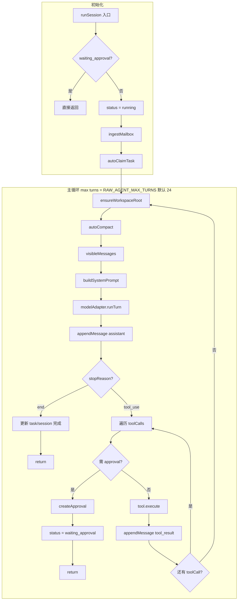
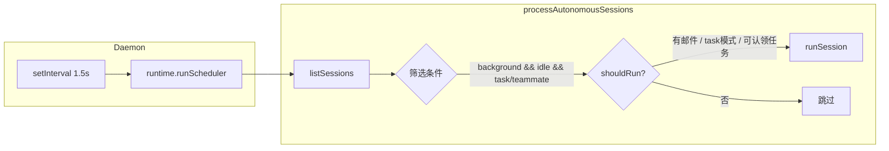
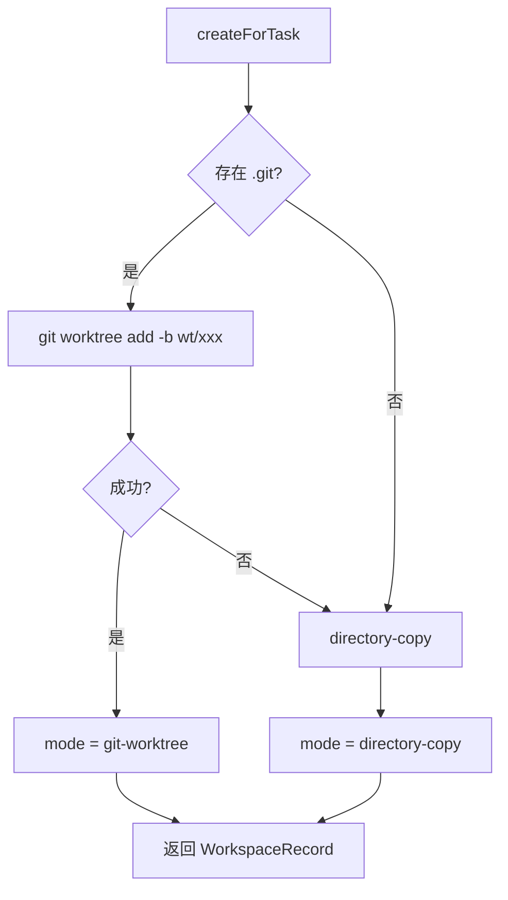
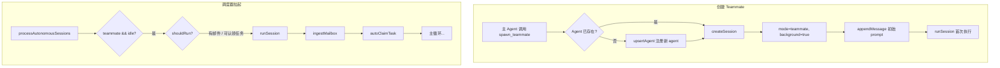
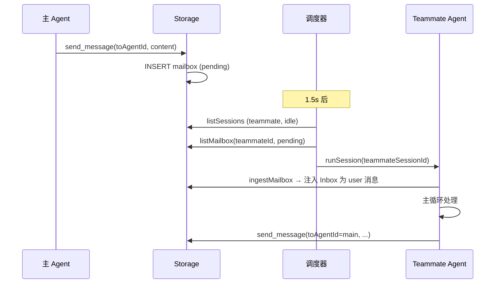
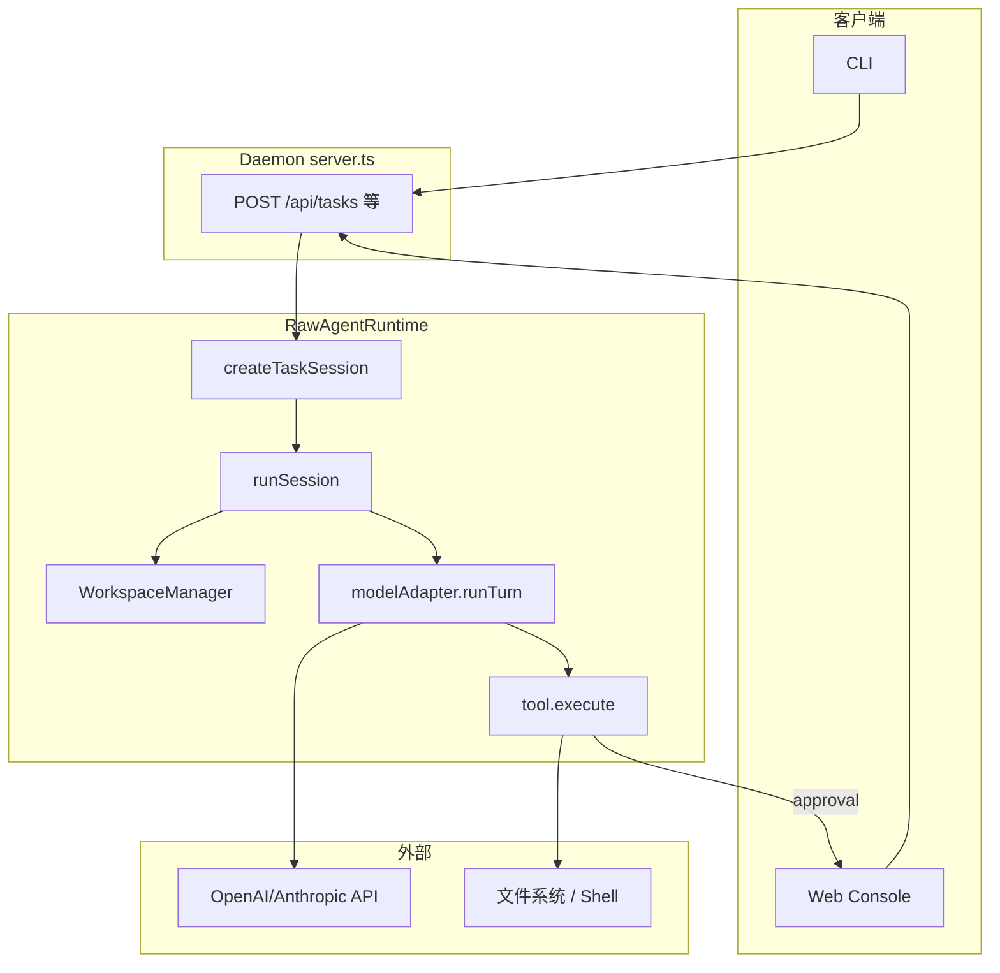
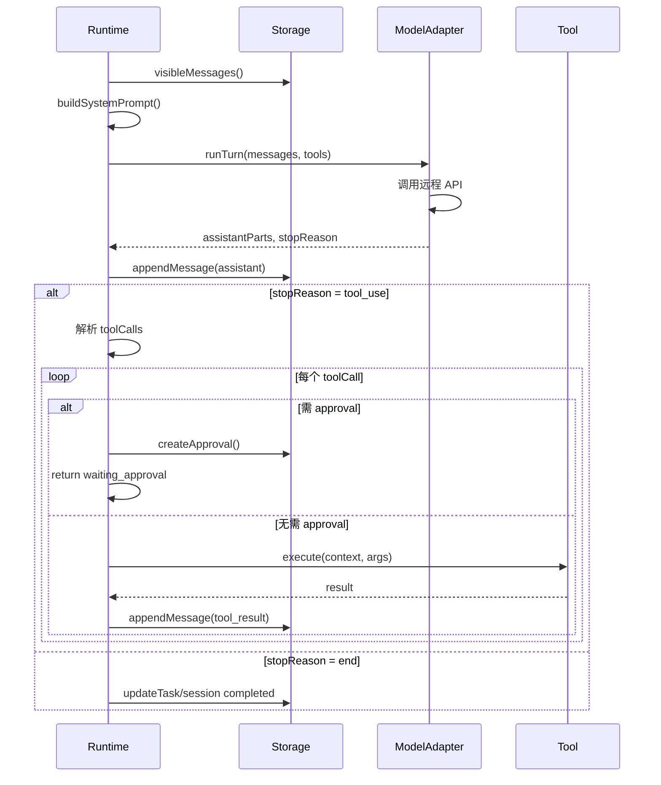

# Raw Agent SDK 项目架构

## 1. 概述

Raw Agent SDK 是一个类 Claude Code 风格的多智能体运行时，采用 Node.js 实现，包含本地 daemon、CLI、Web 控制台、SQLite 持久化、任务/工作区隔离、审批流程和团队编排能力。

## 2. 目录结构

```
my-raw-agent-sdk/
├── packages/
│   └── core/           # 核心运行时
│       ├── src/
│       │   ├── runtime.ts      # 主运行时
│       │   ├── storage.ts      # SQLite 持久化
│       │   ├── model-adapters.ts   # 模型适配器
│       │   ├── tools.ts        # 内置工具
│       │   ├── workspaces.ts   # 工作区管理
│       │   ├── builtin-agents.ts
│       │   ├── builtin-skills.ts
│       │   ├── types.ts
│       │   └── id.ts
│       └── test/
├── apps/
│   ├── daemon/         # HTTP API 服务
│   ├── cli/            # 终端客户端
│   └── web-console/    # 静态 Web UI
├── docs/
│   └── ARCHITECTURE.md
├── package.json
└── .env.example
```

## 3. 模块架构

### 3.1 核心包 (packages/core)

| 模块 | 职责 |
|------|------|
| `runtime.ts` | 会话编排、任务执行、工具调用、调度循环 |
| `storage.ts` | SQLite 持久化，管理 agents/sessions/tasks/approvals/workspaces/mailbox |
| `model-adapters.ts` | 模型抽象：Heuristic / OpenAI 兼容 / Anthropic 兼容 |
| `tools.ts` | 内置工具（read_file, write_file, bash, TodoWrite, harness_write_spec 等） |
| `workspaces.ts` | 工作区创建：git-worktree 或 directory-copy |
| `builtin-agents.ts` | main / planner / generator / evaluator / researcher / implementer / reviewer |
| `builtin-skills.ts` | **Primary** skills (always in system prompt) vs **extension** (catalog only; `load_skill(name)` loads body); workspace `skills/**/SKILL.md` are extension |

### 3.2 应用层

| 应用 | 职责 |
|------|------|
| `apps/daemon` | HTTP API、静态资源托管、后台调度（每 1.5s 调用 runScheduler） |
| `apps/cli` | 通过 HTTP 调用 daemon，执行 chat/send/task/approve 等命令 |
| `apps/web-console` | 前端 SPA（index.html + app.js + styles.css），轮询 /api/sessions、/api/tasks、/api/approvals、/api/agents、/api/workspaces、/api/mailbox，支持创建 chat/task、创建 teammate、发送 mailbox、审批、会话对话、任务详情、Run Scheduler |

## 4. 数据模型

### 4.1 核心实体

```
Session (会话)
├── mode: chat | task | subagent | teammate
├── status: idle | running | waiting_approval | completed | failed
├── agentId, taskId?, workspaceId?, parentSessionId?
├── background: boolean
└── todo[], summary[]

SessionMessage / MessagePart
├── role: system | user | assistant | tool
├── parts: TextPart | ToolCallPart | ToolResultPart
└── createdAt

Task (任务)
├── status: pending | in_progress | completed | failed | cancelled
├── ownerAgentId?, blockedBy[]
├── workspaceId?
└── artifacts[]

Workspace (工作区)
├── mode: git-worktree | directory-copy
├── sourcePath, rootPath
└── taskId

Approval (审批)
├── toolName, args
├── status: pending | approved | rejected
└── sessionId

TaskEvent (任务事件)
├── taskId, kind, actor
├── payload: Record
└── createdAt

BackgroundJobRecord (后台任务)
├── sessionId, command
├── status: running | completed | error
└── result?
```

### 4.2 任务依赖 (blockedBy)

Task 支持 `blockedBy: string[]` 指定依赖的其他 task。当被依赖的 task 完成时，`unblockDependentTasks` 会移除其 id 并可能将依赖方状态置为 `pending`。

### 4.3 存储表 (SQLite)

- `agents` / `sessions` / `session_messages` / `tasks` / `task_events`
- `approvals` / `workspaces` / `mailbox` / `background_jobs`

### 4.4 TaskEvent 类型

| kind | 触发时机 |
|------|----------|
| `task.created` | createTask 时 |
| `workspace.bound` | ensureWorkspaceRoot 绑定工作区时 |
| `task.completed` | session 完成且 mode=task 时 |

## 5. 执行流程

### 5.1 会话执行 (runSession) — Agent 主循环



### 5.2 调度器 (runScheduler)

每 1.5 秒由 daemon 调用：



### 5.3 上下文压缩 (autoCompact)

当 `estimateSize(messages) >= 32_000` 或消息条数过多时：
1. 保留最近 `MAX_VISIBLE_MESSAGES`(24) 条
2. 调用 `modelAdapter.summarizeMessages` 压缩更早的消息
3. 将旧消息归档到 `stateDir/transcripts/{sessionId}/*.jsonl`
4. 更新 `session.summary`，下次 `visibleMessages` 时以 summary + 最近消息作为上下文

### 5.3.1 内置 Skill 分层（OpenClaw 式渐进披露）

- **Primary**：`SkillSpec.tier === 'primary'` 的短规则**始终**写入 `buildSystemPrompt`（Planning、Subagents、Skills 分层说明、Compression、Tasks、Team、Verification discipline 等）。
- **Extension**：仅 **名称 + description** 出现在「Extension skill catalog」；**全文**只在调用 `load_skill(精确名称)` 或用户明确点名该 skill 时通过工具结果进入对话。仓库 `skills/**/SKILL.md` 一律视为 extension。
- 已移除「用户消息触发词自动注入 extension 全文」，避免默认上下文膨胀。

### 5.4 后台任务 (bg_run)

`bg_run` 工具在 session 的 workspace（或 repoRoot）中 spawn 子进程执行命令。完成后：
- 更新 `background_jobs` 表 status、result
- 将输出作为 user 消息 append 到 session，触发下一轮 runSession

### 5.5 工作区创建



## 6. 模型适配器

| 适配器 | 用途 | 配置 |
|--------|------|------|
| `heuristic` | 本地无密钥模式，简单规则回复 | 默认 |
| `openai-compatible` | OpenAI 兼容 chat completions | RAW_AGENT_BASE_URL, API_KEY, MODEL_NAME |
| `anthropic-compatible` | Anthropic API | RAW_AGENT_ANTHROPIC_URL, API_KEY, MODEL_NAME |

模型接口：`runTurn(ModelTurnInput)` → `ModelTurnResult`；`summarizeMessages(SummaryInput)` → string。

**Subagent 角色映射**：`spawn_subagent(prompt, role)` 中 `research`→researcher、`implement`→implementer、`review`→reviewer、`planner`→planner、`generator`→generator、`evaluator`→evaluator，否则用父 agent。

### 6.1 长运行 Harness（对齐 Anthropic planner / generator / evaluator）

- **Planner**：短提示扩展为高层产品说明与功能边界；用 `harness_write_spec(kind=product_spec)` 写入 `.raw-agent-harness/product_spec.md`；可用 `task_create` + `blockedBy` 排期。
- **Generator**：一次一个 sprint/功能；实现前用 `harness_write_spec(kind=sprint_contract)` 写可验收的 sprint 合约；实现后优先 `spawn_subagent(role=evaluator)` 做外部质检。
- **Evaluator**：独立、偏怀疑的 QA；`harness_write_spec(kind=evaluator_feedback)` 记录结论。
- **上下文**：仍依赖现有 `autoCompact` + `session.summary`；结构化 Markdown 作为跨压缩/子会话 handoff 的补充。
- **环境**：`RAW_AGENT_MAX_TURNS` 可提高单轮 `runSession` 的 turn 上限（长 sprint）。

## 7. 内置工具 (21 个)

| 工具 | 说明 | approvalMode |
|------|------|--------------|
| `read_file` | 读文件/列目录 | never |
| `write_file` | 写文件 | auto |
| `edit_file` | 替换文本 | auto |
| `bash` | 执行 shell | auto（含 rm/git reset 等需审批） |
| `TodoWrite` | 更新 todo 列表 | never |
| `load_skill` | 加载 workspace skill | never |
| `task_create` / `task_get` / `task_update` / `task_list` | 任务 CRUD；`task_update` 支持 metadata 浅合并 | never |
| `harness_write_spec` | 写入 `.raw-agent-harness/` 下 product_spec / sprint_contract / evaluator_feedback | never |
| `spawn_subagent` | 同步子 agent | never |
| `spawn_teammate` | 异步 teammate | never |
| `list_team` | 列出 agent | never |
| `send_message` | 发 mailbox 消息 | never |
| `read_inbox` | 读收件箱 | never |
| `bg_run` / `bg_check` | 后台任务 | auto / never |
| `workspace_list` | 列工作区 | never |
| `record_summary` | 创建 summary artifact | never |

## 8. Teams 与 Teammate 编排

### 8.1 概念

| 模式 | 说明 | 执行方式 |
|------|------|----------|
| **subagent** | 同步子 agent，父会话等待子完成 | `spawn_subagent` 调用后阻塞，子 runSession 结束才返回 |
| **teammate** | 异步 teammate，后台持续运行 | `spawn_teammate` 创建 session(background=true)，由调度器周期性拉起 |

Teammate 用于可并行、可拆分的协作任务；通过 **Mailbox** 在 agent 间异步传递消息。

### 8.2 核心组件

- **Mailbox**：SQLite 表 `mailbox`，字段 `from_agent_id`、`to_agent_id`、`type`、`content`、`correlation_id`、`status`(pending/read)
- **send_message**：向指定 agent 发消息，写入 mailbox
- **read_inbox**：读取当前 agent 的收件箱（工具调用）
- **ingestMailbox**：`runSession` 启动时，将 pending 邮件注入为 user 消息
- **autoClaimTask**：teammate 模式下，自动认领无主且无依赖的 pending 任务

### 8.3 Teammate 生命周期



### 8.4 Agent 间消息流



### 8.5 数据模型补充

```
MailRecord (mailbox 表)
├── fromAgentId, toAgentId
├── type, content
├── correlationId?, sessionId?, taskId?
├── status: pending | read
└── createdAt, readAt?
```

## 9. Daemon API

| 方法 | 路径 | 说明 |
|------|------|------|
| GET | `/api/health` | 健康检查 |
| GET | `/api/sessions` | 会话列表 |
| POST | `/api/chat` | 创建 chat 或发送消息并执行 |
| POST | `/api/sessions` | 创建 chat/task 会话 |
| POST | `/api/sessions/:id/messages` | 发送消息 |
| GET | `/api/sessions/:id` | 会话详情 |
| GET | `/api/tasks` | 任务列表 |
| POST | `/api/tasks` | 创建任务 |
| GET | `/api/tasks/:id` | 任务详情 + events |
| POST | `/api/scheduler/run` | 手动触发调度 |
| GET | `/api/agents` | Agent 列表 |
| GET | `/api/approvals` | 审批列表 |
| POST | `/api/approvals/:id/approve` | 批准（session 变 idle 并注入 user 消息；background 会话由调度器自动拉起） |
| POST | `/api/approvals/:id/reject` | 拒绝 |
| GET | `/api/workspaces` | 工作区列表 |
| GET | `/api/background-jobs` | 后台任务列表 |

静态资源：`/` → `apps/web-console/src/index.html`，`/app.js`、`/styles.css` 等。

### 9.1 CLI 命令

| 命令 | 说明 |
|------|------|
| `chat <message>` | 创建 chat 会话并执行 |
| `send <sessionId> <message>` | 向已有会话发消息 |
| `session ls` | 列出会话 |
| `session show <sessionId>` | 查看会话详情与消息 |
| `task create <title> [description]` | 创建任务 |
| `task ls` | 列出任务 |
| `task show <taskId>` | 查看任务详情与 events |
| `approve <approvalId> [approve/reject]` | 审批 |
| `agent ls` | 列出 Agent |
| `workspace ls` | 列出工作区 |
| `scheduler run` | 手动触发调度 |

### 9.2 环境变量

| 变量 | 说明 | 默认 |
|------|------|------|
| `RAW_AGENT_STATE_DIR` | 状态目录 | `.agent-state` |
| `RAW_AGENT_DAEMON_HOST` | Daemon 监听地址 | `127.0.0.1` |
| `RAW_AGENT_DAEMON_PORT` | Daemon 端口 | `7070` |
| `RAW_AGENT_MODEL_PROVIDER` | 模型提供商 | `heuristic` |
| `RAW_AGENT_MODEL_NAME` | 模型名称 | - |
| `RAW_AGENT_API_KEY` | API Key | - |
| `RAW_AGENT_BASE_URL` | OpenAI 兼容 API 地址 | - |
| `RAW_AGENT_ANTHROPIC_URL` | Anthropic API 地址 | - |
| `RAW_AGENT_USE_JSON_MODE` | 第三方 API 不支持 response_format 时设为 `0` | - |
| `RAW_AGENT_MAX_TURNS` | 单次 `runSession` 最大模型轮数（长 sprint 可调大） | `24` |

## 10. 数据流

### 10.1 请求到执行链路



### 10.2 单轮 Turn 内部流程



## 11. 扩展点

- **模型**：实现 `ModelAdapter` 接口，替换 `createModelAdapterFromEnv`
- **工具**：实现 `ToolContract`，传入 `RuntimeOptions.tools`
- **Agent**：`RuntimeOptions.agents` 覆盖默认 builtin
- **Skill**：在 `skills/` 目录放置 `SKILL.md`（含 frontmatter），自动加载
